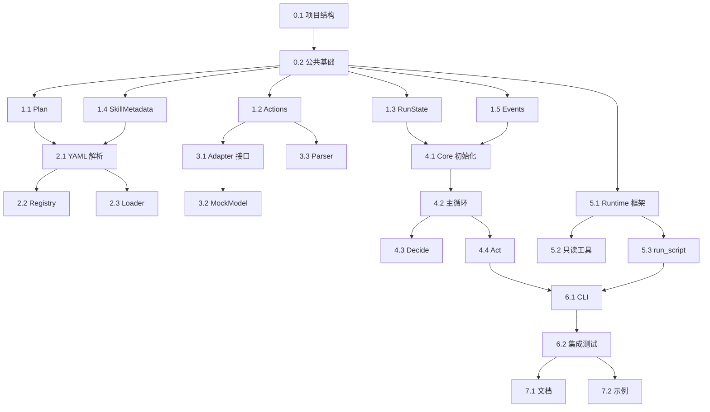

# Agent Skills 系统开发计划

**目标受众**: Claude Code AI 编程助手
**项目**: Agent Skills 技能系统 Python 原生实现
**参考文档**:
- [总体技术设计](file:///Users/peng/Me/Ai/skills-agent/docs/agent-skills-tech-design.md)
- [框架架构设计](file:///Users/peng/Me/Ai/skills-agent/docs/design/framework-architecture.md)

---

## 开发原则

### 🤖 针对 AI 助手的特殊要求

1. **每个任务完全独立**：包含所有必要的上下文、依赖说明、数据结构定义
2. **明确的验收标准**：每个任务有清晰的"完成定义"（Definition of Done）
3. **可测试优先**：每个任务包含测试用例，便于验证实现正确性
4. **增量可运行**：每完成一个阶段，系统可独立运行并验证
5. **最小依赖**：使用 Python 标准库，避免外部依赖
6. **现代化工具链**：使用 uv 作为包管理器，快速、可靠、现代化

### 📋 任务结构

每个任务包含：
- **目标**：清晰描述要实现什么
- **输入**：需要哪些已有代码/文件
- **输出**：生成哪些文件
- **数据结构**：涉及的核心数据结构（完整定义）
- **验收标准**：如何验证任务完成
- **测试用例**：必须通过的测试

---

## 阶段划分

### 🎯 MVP 目标

实现一个可工作的 Agent Skills 系统骨架，能够：
1. 扫描并索引技能目录
2. 使用 MockModel 执行简单的 ReAct 循环
3. 加载技能正文
4. 执行脚本（受控）
5. 持久化运行状态
6. 输出事件流

### 📅 阶段规划

- **阶段 0**: 项目基础设施（1-2 任务）
- **阶段 1**: 核心数据结构（3-5 任务）
- **阶段 2**: 技能子系统（6-8 任务）
- **阶段 3**: 模型适配层（9-11 任务）
- **阶段 4**: Agent Core 骨架（12-15 任务）
- **阶段 5**: Tools Runtime（16-18 任务）
- **阶段 6**: CLI 与集成（19-21 任务）
- **阶段 7**: 测试与验证（22-24 任务）

---

## 阶段 0: 项目基础设施

### 任务 0.1: 创建项目结构与配置

**目标**: 创建标准 Python 项目结构，配置开发环境

**输出文件**:
```
├── src/
│   ├── __init__.py
│   ├── agent/
│   │   └── __init__.py
│   ├── skills/
│   │   └── __init__.py
│   ├── model/
│   │   └── __init__.py
│   ├── tools/
│   │   └── __init__.py
│   ├── common/
│   │   └── __init__.py
│   ├── distribution/
│   │   └── __init__.py
│   └── evals/
│       └── __init__.py
├── tests/
│   ├── __init__.py
│   ├── unit/
│   │   └── __init__.py
│   ├── integration/
│   │   └── __init__.py
│   └── fixtures/
│       ├── skills/
│       └── configs/
├── skills_builtin/
├── pyproject.toml
├── .gitignore
└── README.md
```

**pyproject.toml 内容**:
```toml
[project]
name = "skills-agent"
version = "0.1.0"
description = "Agent Skills System - Python Native Implementation"
requires-python = ">=3.11"
dependencies = []

[project.optional-dependencies]
dev = [
    "pytest>=7.4.0",
    "pytest-cov>=4.1.0",
    "ruff>=0.1.0",
    "mypy>=1.5.0",
]

[build-system]
requires = ["hatchling"]
build-backend = "hatchling.build"

[tool.pytest.ini_options]
testpaths = ["tests"]
pythonpath = ["src"]

[tool.ruff]
line-length = 100
target-version = "py311"
select = ["E", "F", "I", "N", "W", "UP"]

[tool.ruff.format]
quote-style = "double"
indent-style = "space"

[tool.mypy]
python_version = "3.11"
strict = true

[tool.uv]
dev-dependencies = [
    "pytest>=7.4.0",
    "pytest-cov>=4.1.0",
    "ruff>=0.1.0",
    "mypy>=1.5.0",
]
```

**.gitignore 内容**:
```
# Python
__pycache__/
*.py[cod]
*$py.class
*.so
.Python
build/
dist/
*.egg-info/

# Agent
.agent/
!.agent/skills/.gitkeep

# IDE
.vscode/
.idea/

# Testing
.pytest_cache/
.coverage
htmlcov/

# OS
.DS_Store
```

**验收标准**:
- ✅ 所有目录和 `__init__.py` 文件创建完成
- ✅ `pyproject.toml` 可被 pip 识别
- ✅ 运行 `python -m pytest tests/` 不报错（即使没有测试）

**测试用例**:
```bash
# 验证项目结构
ls src/agent/__init__.py
ls src/skills/__init__.py

# 验证可导入
python -c "import src.agent"
python -c "import src.skills"

# 验证 pytest
python -m pytest tests/ -v
```

---

### 任务 0.2: 实现公共基础设施模块

**目标**: 实现配置加载、日志系统、安全工具等公共模块

**输出文件**:
- `src/common/config.py` - 配置加载器
- `src/common/logging_config.py` - 日志配置
- `src/common/security.py` - 安全工具（路径校验）
- `src/common/hash_utils.py` - 哈希与校验
- `tests/unit/test_common.py` - 单元测试

**关键实现**:

**src/common/config.py**:
```python
"""配置加载与管理"""
import json
from pathlib import Path
from typing import Dict, Any, Optional

class Config:
    """配置管理器"""

    DEFAULT_CONFIG = {
        "skill_roots": [
            {"source": "project", "path": ".agent/skills", "priority": 0},
            {"source": "user", "path": "~/.agent/skills", "priority": 1},
        ],
        "model": {"provider": "mock", "params": {}},
        "budget": {
            "max_turns": 12,
            "max_tool_calls": 30,
            "max_script_executions": 10,
            "max_context_tokens": 100000,
        },
        "execution": {
            "require_approval_for": ["run_script"],
            "allowed_tools": ["read_file", "list_dir", "grep", "run_script"],
        },
        "security": {
            "max_skill_body_lines": 500,
            "max_resource_file_bytes": 2000000,
        },
        "logging": {"level": "INFO", "format": "text"},
    }

    def __init__(self, config_path: Optional[Path] = None):
        self.config_path = config_path
        self._config: Dict[str, Any] = {}
        self._load()

    def _load(self):
        """加载配置"""
        self._config = self.DEFAULT_CONFIG.copy()

        if self.config_path and self.config_path.exists():
            with open(self.config_path) as f:
                user_config = json.load(f)
                self._merge_config(user_config)

    def _merge_config(self, user_config: Dict[str, Any]):
        """合并用户配置"""
        for key, value in user_config.items():
            if isinstance(value, dict) and key in self._config:
                self._config[key].update(value)
            else:
                self._config[key] = value

    def get(self, key: str, default: Any = None) -> Any:
        """获取配置项"""
        keys = key.split(".")
        value = self._config
        for k in keys:
            if isinstance(value, dict):
                value = value.get(k)
                if value is None:
                    return default
            else:
                return default
        return value

    def to_dict(self) -> Dict[str, Any]:
        """导出为字典"""
        return self._config.copy()
```

**src/common/security.py**:
```python
"""安全工具：路径校验、注入防护"""
from pathlib import Path
from typing import Optional

class PathTraversalError(Exception):
    """路径穿越错误"""
    pass

def validate_path_in_root(file_path: Path, root_path: Path) -> Path:
    """
    验证文件路径在根目录内，防止路径穿越

    Args:
        file_path: 要验证的文件路径
        root_path: 根目录

    Returns:
        解析后的绝对路径

    Raises:
        PathTraversalError: 路径在根目录外
    """
    try:
        # 解析为绝对路径
        abs_file = file_path.resolve()
        abs_root = root_path.resolve()

        # 检查是否在根目录内
        abs_file.relative_to(abs_root)

        return abs_file
    except ValueError:
        raise PathTraversalError(
            f"Path {file_path} is outside root {root_path}"
        )

def validate_relative_path(relative_path: str) -> bool:
    """
    验证相对路径的安全性

    Args:
        relative_path: 相对路径字符串

    Returns:
        是否安全
    """
    # 禁止绝对路径
    if relative_path.startswith("/"):
        return False

    # 禁止 .. 路径段
    if ".." in Path(relative_path).parts:
        return False

    return True

def sanitize_frontmatter(text: str) -> str:
    """
    净化 YAML 前言，移除危险字符

    Args:
        text: 前言文本

    Returns:
        净化后的文本
    """
    # 移除尖括号（防止注入）
    text = text.replace("<", "").replace(">", "")
    return text
```

**src/common/hash_utils.py**:
```python
"""哈希与校验工具"""
import hashlib
from pathlib import Path

def compute_file_hash(file_path: Path) -> str:
    """计算文件 SHA256 哈希"""
    sha256 = hashlib.sha256()
    with open(file_path, "rb") as f:
        for chunk in iter(lambda: f.read(8192), b""):
            sha256.update(chunk)
    return sha256.hexdigest()

def compute_text_hash(text: str) -> str:
    """计算文本 SHA256 哈希"""
    return hashlib.sha256(text.encode("utf-8")).hexdigest()
```

**验收标准**:
- ✅ Config 类可加载默认配置
- ✅ Config 类可合并用户配置
- ✅ 路径校验可检测到 `..` 穿越
- ✅ 路径校验可检测到符号链接逃逸
- ✅ 所有函数有类型注解和 docstring
- ✅ 单元测试覆盖率 > 80%

**测试用例** (`tests/unit/test_common.py`):
```python
import pytest
from pathlib import Path
from src.common.config import Config
from src.common.security import (
    validate_path_in_root,
    validate_relative_path,
    PathTraversalError,
)
from src.common.hash_utils import compute_text_hash

def test_config_default():
    """测试默认配置"""
    config = Config()
    assert config.get("budget.max_turns") == 12
    assert config.get("model.provider") == "mock"

def test_validate_path_in_root_success(tmp_path):
    """测试路径校验成功"""
    root = tmp_path / "root"
    root.mkdir()
    file_path = root / "file.txt"
    file_path.touch()

    result = validate_path_in_root(file_path, root)
    assert result == file_path.resolve()

def test_validate_path_in_root_traversal(tmp_path):
    """测试路径穿越检测"""
    root = tmp_path / "root"
    root.mkdir()
    outside = tmp_path / "outside.txt"
    outside.touch()

    with pytest.raises(PathTraversalError):
        validate_path_in_root(outside, root)

def test_validate_relative_path():
    """测试相对路径验证"""
    assert validate_relative_path("scripts/test.py") is True
    assert validate_relative_path("../etc/passwd") is False
    assert validate_relative_path("/etc/passwd") is False

def test_compute_text_hash():
    """测试文本哈希"""
    hash1 = compute_text_hash("hello")
    hash2 = compute_text_hash("hello")
    hash3 = compute_text_hash("world")

    assert hash1 == hash2
    assert hash1 != hash3
    assert len(hash1) == 64  # SHA256
```

---

## 阶段 1: 核心数据结构

### 任务 1.1: 实现 Plan 数据结构

**目标**: 实现完整的 Plan 和 PlanStep 数据结构

**输入**:
- [框架设计文档 § 2.2](file:///Users/peng/Me/Ai/skills-agent/docs/design/framework-architecture.md)

**输出文件**:
- `src/agent/plan.py`
- `tests/unit/test_plan.py`

**完整实现**: 参考框架设计文档第 2.2 节的完整代码

**额外要求**:
- 实现 `get_progress_summary()` 方法返回进度摘要
- 实现 `detect_deadlock()` 方法检测连续N个步骤无进展
- 所有方法必须有类型注解

**验收标准**:
- ✅ PlanStep 可序列化/反序列化
- ✅ Plan 可序列化/反序列化
- ✅ `update_step_status()` 正确更新状态
- ✅ `get_next_pending_step()` 正确处理依赖
- ✅ 检测到循环依赖时抛出异常
- ✅ 测试覆盖率 > 90%

**测试用例**:
```python
def test_plan_step_serialization():
    """测试步骤序列化"""
    step = PlanStep(id="s1", title="Test Step")
    data = step.to_dict()
    restored = PlanStep.from_dict(data)
    assert restored.id == step.id
    assert restored.title == step.title

def test_plan_next_step_with_dependencies():
    """测试依赖处理"""
    plan = Plan(
        goal="Test",
        steps=[
            PlanStep(id="s1", title="First"),
            PlanStep(id="s2", title="Second", dependencies=["s1"]),
        ]
    )

    # s1 未完成，s2 不应返回
    next_step = plan.get_next_pending_step()
    assert next_step.id == "s1"

    # s1 完成后，应返回 s2
    plan.update_step_status("s1", StepStatus.COMPLETED)
    next_step = plan.get_next_pending_step()
    assert next_step.id == "s2"
```

---

### 任务 1.2: 实现 Actions 数据结构

**目标**: 实现所有结构化动作类型

**输入**:
- [框架设计文档 § 2.3](file:///Users/peng/Me/Ai/skills-agent/docs/design/framework-architecture.md)

**输出文件**:
- `src/agent/actions.py`
- `tests/unit/test_actions.py`

**完整实现**: 参考框架设计文档第 2.3 节的完整代码

**额外要求**:
- 实现 `parse_action()` 工厂函数
- 每个 Action 必须实现 `validate()` 方法
- 路径类动作必须验证 `..` 不在路径中

**验收标准**:
- ✅ 所有 5 种动作类型可序列化/反序列化
- ✅ `parse_action()` 可正确解析 JSON
- ✅ `validate()` 可检测非法参数
- ✅ 路径穿越尝试被 `validate()` 拒绝
- ✅ 测试覆盖率 > 90%

**测试用例**:
```python
def test_select_skills_action():
    """测试选择技能动作"""
    action = SelectSkillsAction(
        skills=[SkillReference(name="test", source="project")],
        reason="Testing"
    )

    assert action.validate() is True
    data = action.to_dict()
    assert data["action"] == "select_skills"

    restored = parse_action(data)
    assert isinstance(restored, SelectSkillsAction)
    assert restored.skills[0].name == "test"

def test_load_resource_path_traversal():
    """测试路径穿越检测"""
    action = LoadResourceAction(
        skill=SkillReference(name="test"),
        relative_path="../../../etc/passwd"
    )

    assert action.validate() is False
```

---

### 任务 1.3: 实现 RunState 数据结构

**目标**: 实现运行状态管理

**输入**:
- [框架设计文档 § 2.1](file:///Users/peng/Me/Ai/skills-agent/docs/design/framework-architecture.md)
- 已完成的 `plan.py`

**输出文件**:
- `src/agent/state.py`
- `tests/unit/test_state.py`

**完整实现**: 参考框架设计文档第 2.1 节的完整代码

**额外要求**:
- ToolBudget 增加 `consume_turn()`, `consume_tool_call()` 等方法
- RunState 增加 `add_observation()` 方法
- 实现 `estimate_context_tokens()` 方法（粗略估算：字符数/4）

**验收标准**:
- ✅ ToolBudget 可正确追踪预算消耗
- ✅ `can_continue()` 正确判断预算
- ✅ `is_near_limit()` 正确判断阈值
- ✅ RunState 可序列化为 JSON
- ✅ Observation 包含时间戳
- ✅ 测试覆盖率 > 85%

**测试用例**:
```python
def test_budget_consumption():
    """测试预算消耗"""
    budget = ToolBudget(max_turns=5, max_tool_calls=10)

    assert budget.can_continue() is True

    for _ in range(5):
        budget.turns_used += 1

    assert budget.can_continue() is False

def test_budget_near_limit():
    """测试接近限制检测"""
    budget = ToolBudget(max_turns=10)
    budget.turns_used = 8

    assert budget.is_near_limit(threshold=0.8) is True
    assert budget.is_near_limit(threshold=0.9) is False

def test_run_state_serialization():
    """测试运行状态序列化"""
    state = RunState(run_id="test-123", request="Do something")
    data = state.to_dict()

    assert data["run_id"] == "test-123"
    assert data["request"] == "Do something"
    assert "created_at" in data
```

---

### 任务 1.4: 实现 SkillMetadata 数据结构

**目标**: 实现技能元数据结构

**输入**:
- [框架设计文档 § 2.4](file:///Users/peng/Me/Ai/skills-agent/docs/design/framework-architecture.md)

**输出文件**:
- `src/skills/metadata.py`
- `tests/unit/test_metadata.py`

**完整实现**: 参考框架设计文档第 2.4 节的完整代码

**额外要求**:
- 实现 `generate_skill_id()` 静态方法（格式：`{source}:{name}:{version}`）
- ResourceLimits 提供合理默认值
- SkillMetadata 实现 `__str__()` 方法用于调试

**验收标准**:
- ✅ SkillMetadata 可序列化/反序列化
- ✅ ResourceLimits 可序列化/反序列化
- ✅ `get_priority_score()` 返回正确分数
- ✅ LoadedSkill 包含 token 估算
- ✅ 测试覆盖率 > 85%

---

### 任务 1.5: 实现 Events 数据结构

**目标**: 实现事件流系统

**输入**:
- [框架设计文档 § 2.5](file:///Users/peng/Me/Ai/skills-agent/docs/design/framework-architecture.md)

**输出文件**:
- `src/agent/events.py`
- `tests/unit/test_events.py`

**完整实现**: 参考框架设计文档第 2.5 节的完整代码

**额外要求**:
- 实现 `EventStream` 类用于管理事件流
- 支持写入 JSONL 文件
- 支持从 JSONL 文件读取回放

**EventStream 实现**:
```python
class EventStream:
    """事件流管理器"""

    def __init__(self, output_path: Optional[Path] = None):
        self.output_path = output_path
        self._handlers: List[Callable] = []

    def emit(self, event: Event):
        """发送事件"""
        # 写入文件
        if self.output_path:
            with open(self.output_path, "a") as f:
                f.write(event.to_json_line() + "\n")

        # 调用处理器
        for handler in self._handlers:
            handler(event)

    def add_handler(self, handler: Callable):
        """添加事件处理器"""
        self._handlers.append(handler)

    @staticmethod
    def replay(file_path: Path) -> List[Event]:
        """回放事件流"""
        events = []
        with open(file_path) as f:
            for line in f:
                data = json.loads(line)
                event = Event(
                    type=EventType(data["type"]),
                    run_id=data["run_id"],
                    turn=data["turn"],
                    data=data["data"],
                    timestamp=datetime.fromisoformat(data["timestamp"])
                )
                events.append(event)
        return events
```

**验收标准**:
- ✅ Event 可序列化为 JSONL
- ✅ EventStream 可写入文件
- ✅ EventStream 可回放事件
- ✅ 支持添加自定义处理器
- ✅ 测试覆盖率 > 85%

---

## 阶段 2: 技能子系统

### 任务 2.1: 实现 YAML 前言解析器

**目标**: 实现安全的 YAML 前言子集解析

**输入**:
- [Skill Loader 设计文档](file:///Users/peng/Me/Ai/skills-agent/docs/design/skill-loader.md)
- 已完成的 `metadata.py`

**输出文件**:
- `src/skills/frontmatter.py`
- `tests/unit/test_frontmatter.py`

**核心实现**:
```python
"""YAML 前言解析器（安全子集）"""
import re
from typing import Dict, Any, Optional
from pathlib import Path

class FrontmatterParseError(Exception):
    """前言解析错误"""
    pass

def parse_frontmatter(content: str) -> tuple[Dict[str, Any], str]:
    """
    解析 SKILL.md 的 YAML 前言

    Args:
        content: SKILL.md 完整内容

    Returns:
        (前言字典, 正文内容)

    Raises:
        FrontmatterParseError: 解析失败
    """
    # 匹配 YAML 前言 (--- ... ---)
    pattern = r'^---\s*\n(.*?)\n---\s*\n(.*)$'
    match = re.match(pattern, content, re.DOTALL)

    if not match:
        raise FrontmatterParseError("No frontmatter found")

    yaml_text = match.group(1)
    body = match.group(2)

    # 安全检查
    if '<' in yaml_text or '>' in yaml_text:
        raise FrontmatterParseError("Angle brackets not allowed in frontmatter")

    # 解析 YAML（仅支持简单字段）
    frontmatter = _parse_simple_yaml(yaml_text)

    # 验证必需字段
    if 'name' not in frontmatter:
        raise FrontmatterParseError("Missing required field: name")
    if 'description' not in frontmatter:
        raise FrontmatterParseError("Missing required field: description")

    return frontmatter, body

def _parse_simple_yaml(yaml_text: str) -> Dict[str, Any]:
    """
    解析简单 YAML（仅支持标量和列表）
    """
    result: Dict[str, Any] = {}
    current_key: Optional[str] = None
    current_list: list = []

    for line in yaml_text.split('\n'):
        line = line.rstrip()

        if not line or line.startswith('#'):
            continue

        # 列表项
        if line.startswith('  - ') or line.startswith('- '):
            item = line.lstrip('- ').strip()
            current_list.append(item)
            continue

        # 键值对
        if ':' in line:
            # 保存之前的列表
            if current_key and current_list:
                result[current_key] = current_list
                current_list = []

            key, value = line.split(':', 1)
            key = key.strip()
            value = value.strip()

            current_key = key

            # 值为空，可能是列表开始
            if not value:
                continue

            # 解析值类型
            if value.lower() == 'true':
                result[key] = True
            elif value.lower() == 'false':
                result[key] = False
            elif value.isdigit():
                result[key] = int(value)
            else:
                # 去除引号
                result[key] = value.strip('"\'')

    # 保存最后的列表
    if current_key and current_list:
        result[current_key] = current_list

    return result
```

**验收标准**:
- ✅ 可解析正确的 YAML 前言
- ✅ 检测到尖括号时抛出异常
- ✅ 缺少必需字段时抛出异常
- ✅ 正确解析布尔值
- ✅ 正确解析列表
- ✅ 正确分离正文
- ✅ 测试覆盖率 > 90%

**测试用例**:
```python
def test_parse_valid_frontmatter():
    """测试解析有效前言"""
    content = """---
name: test-skill
description: A test skill
version: 1.0.0
allowed-tools:
  - read_file
  - grep
---
# Skill Body

This is the skill body.
"""

    frontmatter, body = parse_frontmatter(content)

    assert frontmatter["name"] == "test-skill"
    assert frontmatter["description"] == "A test skill"
    assert frontmatter["version"] == "1.0.0"
    assert frontmatter["allowed-tools"] == ["read_file", "grep"]
    assert "# Skill Body" in body

def test_parse_frontmatter_with_injection():
    """测试注入防护"""
    content = """---
name: evil<script>alert(1)</script>
description: Test
---
Body
"""

    with pytest.raises(FrontmatterParseError, match="Angle brackets"):
        parse_frontmatter(content)
```

---

### 任务 2.2: 实现 Skill Registry

**目标**: 实现技能扫描与索引

**输入**:
- [Skill Registry 设计文档](file:///Users/peng/Me/Ai/skills-agent/docs/design/skill-registry.md)
- 已完成的 `frontmatter.py` 和 `metadata.py`

**输出文件**:
- `src/skills/registry.py`
- `tests/unit/test_registry.py`
- `tests/fixtures/skills/example-skill/SKILL.md` (测试用)

**核心实现要点**:
1. 扫描多个 skill root
2. 对每个目录检查是否存在 SKILL.md
3. 解析前言获取元数据
4. 处理同名技能冲突（按优先级）
5. 生成 skill_id
6. 返回 SkillMetadata 列表

**验收标准**:
- ✅ 可扫描多个 root
- ✅ 忽略无 SKILL.md 的目录
- ✅ 忽略隐藏目录（以 `.` 开头）
- ✅ 同名冲突按优先级解决
- ✅ 前言解析失败时跳过并记录
- ✅ 生成扫描报告
- ✅ 测试覆盖率 > 85%

**关键方法签名**:
```python
class SkillRegistry:
    def __init__(self, skill_roots: List[Dict[str, Any]]):
        ...

    def scan_all(self) -> List[SkillMetadata]:
        """扫描所有技能根目录"""
        ...

    def find_skill(
        self, name: str, source: Optional[str] = None
    ) -> Optional[SkillMetadata]:
        """查找技能"""
        ...

    def refresh(self):
        """刷新技能索引"""
        ...

    def get_scan_report(self) -> Dict[str, Any]:
        """获取扫描报告"""
        ...
```

---

### 任务 2.3: 实现 Skill Loader

**目标**: 实现技能正文和资源加载

**输入**:
- [Skill Loader 设计文档](file:///Users/peng/Me/Ai/skills-agent/docs/design/skill-loader.md)
- 已完成的 `metadata.py`, `frontmatter.py`, `security.py`

**输出文件**:
- `src/skills/loader.py`
- `tests/unit/test_loader.py`

**核心实现要点**:
1. `load_body()`: 加载技能正文（去除前言）
2. `load_resource()`: 加载资源文件（支持 section_hint）
3. 路径安全校验
4. 大小限制
5. Token 估算

**验收标准**:
- ✅ 正文去除前言
- ✅ 正文超过限制时裁剪或拒绝
- ✅ 资源路径越界被拒绝
- ✅ section_hint 可提取指定段落
- ✅ 返回 token 估算值
- ✅ 测试覆盖率 > 85%

**关键方法签名**:
```python
class SkillLoader:
    def load_body(
        self,
        skill_path: Path,
        limits: Optional[Dict[str, Any]] = None
    ) -> Tuple[str, int]:
        """加载技能正文，返回 (正文, token估算)"""
        ...

    def load_resource(
        self,
        skill_path: Path,
        relative_path: str,
        section_hint: Optional[str] = None,
        max_tokens: int = 2000
    ) -> str:
        """加载资源文件"""
        ...

    @staticmethod
    def estimate_tokens(text: str) -> int:
        """估算 token 数（粗略：字符数/4）"""
        return len(text) // 4
```

---

## 阶段 3: 模型适配层

### 任务 3.1: 实现 ModelAdapter 抽象基类

**目标**: 定义模型适配器接口

**输入**:
- [Model Adapter 设计文档](file:///Users/peng/Me/Ai/skills-agent/docs/design/model-adapter.md)

**输出文件**:
- `src/model/adapter.py`
- `tests/unit/test_adapter_interface.py`

**核心实现**:
```python
"""模型适配器抽象基类"""
from abc import ABC, abstractmethod
from typing import Dict, Any, Optional, Callable

class ModelAdapter(ABC):
    """模型适配器抽象基类"""

    @abstractmethod
    def generate(self, context: Dict[str, Any]) -> Dict[str, Any]:
        """
        生成模型响应

        Args:
            context: 上下文字典，包含：
                - request: 用户请求
                - skill_index: 技能索引
                - loaded_skills: 已加载技能
                - plan: 当前计划
                - observations: 观察列表
                - budget: 预算信息

        Returns:
            响应字典，包含：
                - actions: 动作列表
                - raw: 原始响应（可选）
        """
        pass

    @abstractmethod
    def generate_streaming(
        self,
        context: Dict[str, Any],
        callback: Optional[Callable] = None
    ) -> Dict[str, Any]:
        """流式生成（可选）"""
        pass
```

**验收标准**:
- ✅ 定义了清晰的接口
- ✅ 包含完整的类型注解
- ✅ 包含详细的 docstring

---

### 任务 3.2: 实现 MockModel

**目标**: 实现用于测试的 Mock 模型

**输入**:
- [Model Adapter 设计文档 § 10](file:///Users/peng/Me/Ai/skills-agent/docs/design/model-adapter.md)
- 已完成的 `adapter.py` 和 `actions.py`

**输出文件**:
- `src/model/mock.py`
- `tests/unit/test_mock_model.py`

**核心实现**:
```python
"""MockModel 用于测试和评估"""
from typing import Dict, Any, List, Optional, Callable
from src.model.adapter import ModelAdapter

class MockModel(ModelAdapter):
    """Mock 模型（用于测试）"""

    def __init__(self, responses: Optional[List[Dict[str, Any]]] = None):
        """
        Args:
            responses: 预定义的响应序列
        """
        self.responses = responses or []
        self.call_count = 0

    def generate(self, context: Dict[str, Any]) -> Dict[str, Any]:
        """返回预定义响应"""
        if self.call_count >= len(self.responses):
            # 默认返回 final_answer
            return {
                "actions": [{
                    "action": "final_answer",
                    "answer": "Mock response completed",
                    "completed": True
                }]
            }

        response = self.responses[self.call_count]
        self.call_count += 1
        return response

    def generate_streaming(
        self, context: Dict[str, Any], callback: Optional[Callable] = None
    ) -> Dict[str, Any]:
        """Mock 不支持流式"""
        return self.generate(context)

    def reset(self):
        """重置调用计数"""
        self.call_count = 0
```

**验收标准**:
- ✅ 可返回预定义响应序列
- ✅ 响应耗尽后返回默认 final_answer
- ✅ 可重置调用计数
- ✅ 测试覆盖率 > 90%

**测试用例**:
```python
def test_mock_model_predefined_responses():
    """测试预定义响应"""
    responses = [
        {"actions": [{"action": "select_skills", "skills": [{"name": "test"}], "reason": "Testing"}]},
        {"actions": [{"action": "final_answer", "answer": "Done", "completed": True}]},
    ]

    model = MockModel(responses)

    result1 = model.generate({})
    assert result1["actions"][0]["action"] == "select_skills"

    result2 = model.generate({})
    assert result2["actions"][0]["action"] == "final_answer"

    # 耗尽后返回默认
    result3 = model.generate({})
    assert result3["actions"][0]["action"] == "final_answer"
```

---

### 任务 3.3: 实现动作解析器

**目标**: 实现从模型响应解析结构化动作

**输入**:
- [Model Adapter 设计文档 § 6](file:///Users/peng/Me/Ai/skills-agent/docs/design/model-adapter.md)
- 已完成的 `actions.py`

**输出文件**:
- `src/model/parser.py`
- `tests/unit/test_parser.py`

**核心实现**:
```python
"""结构化动作解析器"""
import json
import re
from typing import Dict, Any, List
from src.agent.actions import parse_action, AgentAction

class ParseError(Exception):
    """解析错误"""
    pass

def parse_model_response(response_text: str) -> Dict[str, Any]:
    """
    解析模型响应为结构化格式

    支持：
    1. 纯 JSON
    2. JSON 包含在 markdown code fence 中
    3. JSON 混杂在文本中

    Args:
        response_text: 模型原始响应

    Returns:
        解析后的字典

    Raises:
        ParseError: 解析失败
    """
    # 策略 1: 直接解析 JSON
    try:
        return json.loads(response_text.strip())
    except json.JSONDecodeError:
        pass

    # 策略 2: 提取 code fence 中的 JSON
    fence_pattern = r'```(?:json)?\s*\n(.*?)\n```'
    matches = re.findall(fence_pattern, response_text, re.DOTALL)
    if matches:
        try:
            return json.loads(matches[0])
        except json.JSONDecodeError:
            pass

    # 策略 3: 查找最大的 JSON 对象
    json_pattern = r'\{[^{}]*(?:\{[^{}]*\}[^{}]*)*\}'
    matches = re.findall(json_pattern, response_text, re.DOTALL)
    for match in reversed(matches):  # 从最大的开始尝试
        try:
            return json.loads(match)
        except json.JSONDecodeError:
            continue

    raise ParseError("No valid JSON found in response")

def parse_actions_from_response(response: Dict[str, Any]) -> List[AgentAction]:
    """
    从响应字典解析动作列表

    Args:
        response: 响应字典，包含 'actions' 字段

    Returns:
        AgentAction 对象列表
    """
    actions_data = response.get("actions", [])
    if not isinstance(actions_data, list):
        actions_data = [actions_data]

    actions = []
    for action_data in actions_data:
        action = parse_action(action_data)
        actions.append(action)

    return actions
```

**验收标准**:
- ✅ 可解析纯 JSON
- ✅ 可提取 code fence 中的 JSON
- ✅ 可从混合文本提取 JSON
- ✅ 解析失败时抛出 ParseError
- ✅ 测试覆盖率 > 90%

---

## 阶段 4: Agent Core 骨架

### 任务 4.1: 实现 AgentCore 初始化与状态管理

**目标**: 实现 AgentCore 的基础框架

**输入**:
- [Agent Core 设计文档](file:///Users/peng/Me/Ai/skills-agent/docs/design/agent-core.md)
- 所有已完成的数据结构

**输出文件**:
- `src/agent/core.py` (部分)
- `tests/unit/test_agent_core_init.py`

**本任务范围**:
- `__init__()` 方法
- `_initialize_run_state()` 方法
- `_save_run_state()` 方法
- `_load_run_state()` 方法

**关键实现**:
```python
"""Agent Core 核心执行引擎"""
import uuid
import json
from pathlib import Path
from typing import Dict, Any, Optional, List
from datetime import datetime

from src.agent.state import RunState, RunStatus, ToolBudget
from src.agent.plan import Plan
from src.agent.events import Event, EventType, EventStream
from src.skills.registry import SkillRegistry
from src.skills.loader import SkillLoader
from src.model.adapter import ModelAdapter
from src.tools.runtime import ToolsRuntime

class AgentCore:
    """Agent 核心执行引擎"""

    def __init__(
        self,
        skill_registry: SkillRegistry,
        skill_loader: SkillLoader,
        model_adapter: ModelAdapter,
        tools_runtime: ToolsRuntime,
        config: Dict[str, Any],
        runs_dir: Path = Path(".agent/runs")
    ):
        self.skill_registry = skill_registry
        self.skill_loader = skill_loader
        self.model_adapter = model_adapter
        self.tools_runtime = tools_runtime
        self.config = config
        self.runs_dir = runs_dir
        self.runs_dir.mkdir(parents=True, exist_ok=True)

        self.event_stream: Optional[EventStream] = None

    def _initialize_run_state(self, request: str) -> RunState:
        """初始化运行状态"""
        run_id = f"run-{datetime.now().strftime('%Y%m%d_%H%M%S')}_{uuid.uuid4().hex[:8]}"

        # 索引技能（Level 1：仅元数据）
        skill_index = self.skill_registry.scan_all()

        # 创建初始状态
        budget_config = self.config.get("budget", {})
        state = RunState(
            run_id=run_id,
            request=request,
            skill_index=skill_index,
            budget=ToolBudget(**budget_config),
            status=RunStatus.INITIALIZING
        )

        return state

    def _save_run_state(self, state: RunState):
        """持久化运行状态"""
        run_dir = self.runs_dir / state.run_id
        run_dir.mkdir(exist_ok=True)

        # 保存状态摘要
        state_file = run_dir / "state.json"
        with open(state_file, "w") as f:
            json.dump(state.to_dict(), f, indent=2)

        # 保存 Plan（如果存在）
        if state.plan:
            plan_file = run_dir / "plan.json"
            with open(plan_file, "w") as f:
                json.dump(state.plan.to_dict(), f, indent=2)

    def _load_run_state(self, run_id: str) -> RunState:
        """加载运行状态（用于恢复）"""
        run_dir = self.runs_dir / run_id
        if not run_dir.exists():
            raise ValueError(f"Run {run_id} not found")

        # 加载状态摘要
        state_file = run_dir / "state.json"
        with open(state_file) as f:
            state_data = json.load(f)

        # 重建技能索引
        skill_index = self.skill_registry.scan_all()

        # 重建 RunState
        state = RunState(
            run_id=run_id,
            request=state_data["request"],
            skill_index=skill_index,
            current_turn=state_data["current_turn"],
            status=RunStatus.RUNNING  # 恢复时强制为 RUNNING
        )

        # 恢复预算
        budget_data = state_data.get("budget", {})
        state.budget.turns_used = budget_data.get("turns_used", 0)
        state.budget.tool_calls_used = budget_data.get("tool_calls_used", 0)
        state.budget.script_executions_used = budget_data.get("script_executions_used", 0)

        # 加载 Plan（如果存在）
        plan_file = run_dir / "plan.json"
        if plan_file.exists():
            with open(plan_file) as f:
                plan_data = json.load(f)
                state.plan = Plan.from_dict(plan_data)

        return state
```

**验收标准**:
- ✅ `_initialize_run_state()` 创建有效 RunState
- ✅ `_save_run_state()` 正确保存到文件
- ✅ `_load_run_state()` 可恢复状态
- ✅ Run 目录按 run_id 组织
- ✅ 测试覆盖率 > 85%

---

### 任务 4.2: 实现 AgentCore 主循环（run 方法）

**目标**: 实现 ReAct 主循环

**输入**:
- [Agent Core 设计文档 § 3](file:///Users/peng/Me/Ai/skills-agent/docs/design/agent-core.md)
- 已完成的 `core.py` 初始化部分

**输出文件**:
- `src/agent/core.py` (补充)
- `tests/integration/test_agent_run.py`

**本任务范围**:
- `run()` 方法主循环
- `_decide()` 方法框架
- `_act()` 方法框架

**关键实现** (参考 Agent Core 设计文档):
```python
def run(self, request: str, resume_run_id: Optional[str] = None) -> RunState:
    """执行用户请求"""
    if resume_run_id:
        state = self._load_run_state(resume_run_id)
    else:
        state = self._initialize_run_state(request)

    # 初始化事件流
    events_file = self.runs_dir / state.run_id / "events.jsonl"
    self.event_stream = EventStream(events_file)

    # 发送 run_started 事件
    self.event_stream.emit(Event(
        type=EventType.RUN_STARTED,
        run_id=state.run_id,
        turn=0,
        data={"request": request}
    ))

    try:
        state.status = RunStatus.RUNNING

        # ReAct 主循环
        while state.budget.can_continue() and state.status == RunStatus.RUNNING:
            state.current_turn += 1
            state.budget.turns_used += 1

            # Reason: 获取模型决策
            actions = self._decide(state)

            # Act & Observe: 执行动作并观察结果
            for action in actions:
                observation = self._act(state, action)
                state.add_observation(observation)

                # 检查是否结束
                if action.action_type() == "final_answer":
                    state.status = RunStatus.COMPLETED
                    break

            # 持久化状态
            self._save_run_state(state)

        # 预算耗尽但未完成
        if not state.budget.can_continue() and state.status == RunStatus.RUNNING:
            state.status = RunStatus.FAILED
            state.error = "Budget exhausted"

    except Exception as e:
        state.status = RunStatus.FAILED
        state.error = str(e)
        raise
    finally:
        self._save_run_state(state)

        # 发送 run_finished 事件
        self.event_stream.emit(Event(
            type=EventType.RUN_FINISHED,
            run_id=state.run_id,
            turn=state.current_turn,
            data={"status": state.status.value}
        ))

    return state

def _decide(self, state: RunState) -> List[AgentAction]:
    """Reason 阶段：请求模型决策"""
    # TODO: 在任务 4.3 实现
    pass

def _act(self, state: RunState, action: AgentAction) -> Observation:
    """Act 阶段：执行动作"""
    # TODO: 在任务 4.4 实现
    pass
```

**验收标准**:
- ✅ 主循环可运行（即使 _decide 和 _act 是空实现）
- ✅ 预算耗尽时正确退出
- ✅ 异常时正确设置状态
- ✅ 事件流正确记录
- ✅ 测试覆盖率 > 80%

---

### 任务 4.3: 实现 _decide 方法（上下文构建与模型调用）

**目标**: 实现模型决策逻辑

**输入**:
- [Agent Core 设计文档 § 7](file:///Users/peng/Me/Ai/skills-agent/docs/design/agent-core.md)
- 已完成的 `core.py` 主循环

**输出文件**:
- `src/agent/core.py` (补充 _decide 和 _build_context)
- `tests/unit/test_agent_decide.py`

**本任务范围**:
- `_decide()` 方法完整实现
- `_build_context()` 方法
- `_validate_actions()` 方法

**参考**: 框架设计文档 § 3 中的 `_decide()` 和 `_build_context()` 实现

**验收标准**:
- ✅ 正确构建上下文（包含技能索引、已加载技能、Plan、观察）
- ✅ 调用模型并解析响应
- ✅ 验证动作合法性
- ✅ 处理模型调用失败（返回默认 final_answer）
- ✅ 测试覆盖率 > 85%

---

### 任务 4.4: 实现 _act 方法（动作路由与执行）

**目标**: 实现动作执行逻辑

**输入**:
- [Agent Core 设计文档 § 5](file:///Users/peng/Me/Ai/skills-agent/docs/design/agent-core.md)
- 已完成的所有子系统

**输出文件**:
- `src/agent/core.py` (补充所有 _handle_* 方法)
- `tests/unit/test_agent_actions.py`

**本任务范围**:
- `_act()` 方法完整实现
- `_handle_select_skills()` 方法
- `_handle_load_resource()` 方法
- `_handle_run_script()` 方法
- `_handle_plan_update()` 方法

**参考**: 框架设计文档 § 3 中的完整实现

**验收标准**:
- ✅ 所有动作类型可正确路由
- ✅ select_skills 正确加载技能正文
- ✅ load_resource 正确加载资源文件
- ✅ run_script 正确调用 ToolsRuntime
- ✅ plan_update 正确更新 Plan
- ✅ 错误时返回失败的 Observation
- ✅ 测试覆盖率 > 85%

---

## 阶段 5: Tools Runtime

### 任务 5.1: 实现 ToolsRuntime 基础框架

**目标**: 实现工具运行时的权限检查和审批机制

**输入**:
- [Tools Runtime 设计文档](file:///Users/peng/Me/Ai/skills-agent/docs/design/tools-runtime.md)

**输出文件**:
- `src/tools/runtime.py`
- `src/tools/permissions.py`
- `src/tools/approval.py`
- `tests/unit/test_tools_runtime.py`

**本任务范围**:
- ToolsRuntime 类框架
- 权限检查逻辑
- 审批机制（交互式）

**关键方法**:
```python
class ToolsRuntime:
    def check_permission(
        self, tool_name: str, skill_metadata: SkillMetadata
    ) -> bool:
        """检查工具权限（全局 ∩ 技能 ∩ 运行时）"""
        ...

    def request_approval(
        self, tool_name: str, params: Dict[str, Any]
    ) -> bool:
        """请求审批（交互式）"""
        ...
```

**验收标准**:
- ✅ 权限合并逻辑正确
- ✅ 审批请求可在终端显示
- ✅ 测试覆盖率 > 80%

---

### 任务 5.2: 实现只读工具

**目标**: 实现 read_file, list_dir, grep

**输入**:
- [Tools Runtime 设计文档 § 5](file:///Users/peng/Me/Ai/skills-agent/docs/design/tools-runtime.md)

**输出文件**:
- `src/tools/tools/read_file.py`
- `src/tools/tools/list_dir.py`
- `src/tools/tools/grep.py`
- `tests/unit/test_readonly_tools.py`

**验收标准**:
- ✅ read_file 支持大小限制
- ✅ list_dir 支持条目数限制
- ✅ grep 支持模式搜索
- ✅ 所有工具返回结构化结果
- ✅ 测试覆盖率 > 85%

---

### 任务 5.3: 实现 run_script 工具

**目标**: 实现受控的脚本执行

**输入**:
- [Tools Runtime 设计文档 § 5.4](file:///Users/peng/Me/Ai/skills-agent/docs/design/tools-runtime.md)

**输出文件**:
- `src/tools/executor.py`
- `src/tools/tools/run_script.py`
- `tests/unit/test_run_script.py`

**核心要求**:
- 超时控制
- 工作目录隔离
- 环境变量清理
- 输出截断
- 退出码捕获

**验收标准**:
- ✅ 超时后正确终止进程
- ✅ 输出超过限制时截断
- ✅ 非零退出码被正确记录
- ✅ 路径越界被拒绝
- ✅ 测试覆盖率 > 85%

---

## 阶段 6: CLI 与集成

### 任务 6.1: 实现 CLI 基础框架

**目标**: 实现命令行入口

**输入**:
- [Distribution & CLI 设计文档](file:///Users/peng/Me/Ai/skills-agent/docs/design/distribution-cli.md)

**输出文件**:
- `src/distribution/cli.py`
- `src/distribution/commands/run.py`
- `tests/integration/test_cli.py`

**基础命令**:
```bash
python -m src.distribution.cli run "请求文本"
python -m src.distribution.cli run --resume run-123
python -m src.distribution.cli skills list
```

**验收标准**:
- ✅ run 命令可执行用户请求
- ✅ --resume 可恢复运行
- ✅ skills list 可列出技能
- ✅ 错误时显示有用提示

---

### 任务 6.2: 实现完整集成测试

**目标**: 端到端验证系统

**输入**: 所有已完成模块

**输出文件**:
- `tests/integration/test_full_workflow.py`
- `tests/fixtures/skills/test-skill/SKILL.md`
- `tests/fixtures/skills/test-skill/scripts/hello.py`

**测试场景**:
1. 扫描技能 → 选择技能 → 加载正文 → 执行脚本 → 返回结果
2. 多轮对话
3. 预算耗尽
4. 崩溃恢复

**验收标准**:
- ✅ 完整流程可运行
- ✅ MockModel 驱动多轮交互
- ✅ 事件流正确记录
- ✅ 状态可恢复

---

## 阶段 7: 文档与交付

### 任务 7.1: 编写 README 和使用文档

**目标**: 提供清晰的使用文档

**输出文件**:
- `README.md` (更新)
- `docs/QUICK_START.md`
- `docs/API.md`

**内容要求**:
- 快速开始指南
- 配置说明
- 技能编写指南
- API 参考

---

### 任务 7.2: 创建示例技能

**目标**: 提供可运行的示例

**输出文件**:
- `skills_builtin/example-hello/SKILL.md`
- `skills_builtin/example-hello/scripts/greet.py`
- `skills_builtin/example-calculator/SKILL.md`

**验收标准**:
- ✅ 示例可正常运行
- ✅ 包含完整注释

---

## 任务依赖关系图



---

## 完成标准

整个 MVP 开发完成的标志：

✅ **所有单元测试通过**（覆盖率 > 80%）
✅ **集成测试通过**（完整 E2E 流程）
✅ **CLI 可运行示例任务**
✅ **文档完整**（README + Quick Start）
✅ **代码符合规范**（类型注解 + docstring）
✅ **可演示**：
```bash
# 运行示例
python -m src.distribution.cli run "请使用 example-hello 技能向我问好"

# 查看结果
cat .agent/runs/run-xxx/events.jsonl
cat .agent/runs/run-xxx/state.json
```

---

## 给 Claude Code 的特别提示

### 🤖 最佳实践

1. **每次只处理一个任务**：不要跳跃，按顺序完成
2. **先写测试**：TDD 方式，先定义验收标准
3. **完整实现**：每个文件包含所有必要的 import 和类型注解
4. **参考设计文档**：所有实现必须对齐设计文档
5. **增量验证**：每完成一个任务立即运行测试

### 📋 任务执行模板

对于每个任务：

1. **阅读任务说明**
2. **阅读引用的设计文档相关章节**
3. **编写测试用例**（先写测试）
4. **实现代码**
5. **运行测试验证**
6. **更新文档**（如需要）

### ⚠️ 常见陷阱

- ❌ 不要使用外部依赖（除标准库外）
- ❌ 不要省略类型注解
- ❌ 不要忘记错误处理
- ❌ 不要跳过测试

### ✅ 验收检查清单

每个任务完成后检查：

- [ ] 所有输出文件已创建
- [ ] 代码符合 PEP 8
- [ ] 所有函数有类型注解
- [ ] 所有公共方法有 docstring
- [ ] 测试通过且覆盖率达标
- [ ] 与设计文档对齐

---

**准备好了吗？从任务 0.1 开始！** 🚀
