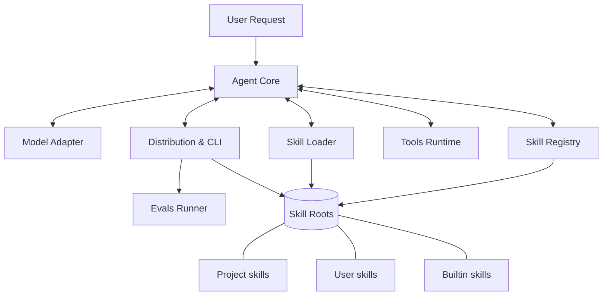
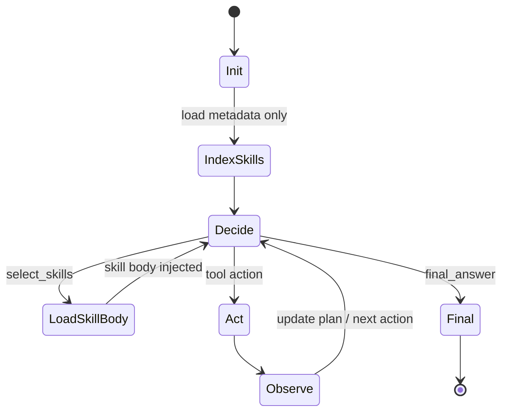
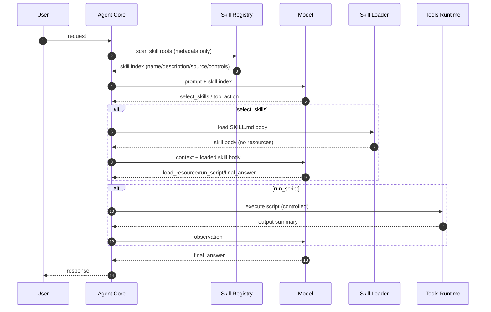

# Agent Skills 技能模式：Python 原生实现技术方案（草案）

本方案用于在本项目实现一个 Agent，使其支持 Agent Skills 技能模式的“标准完整能力”：技能目录结构、技能发现与索引、渐进式披露、技能组合、权限控制、技能分发与安装、评估与回归。

说明：本文仅为技术方案，不包含实现代码。

## 1. 目标与非目标

### 1.1 目标（Must）

- 支持技能目录结构：`<skill-root>/<skill-name>/SKILL.md` + 可选 `scripts/reference/assets`。
- 支持渐进式披露三层加载：
  - 启动仅加载 `name/description` 形成技能索引
  - 触发时加载 `SKILL.md` 正文
  - 需要时再读取 resource 或执行 scripts，并将“结果”注入上下文
- 支持多技能根目录与优先级：项目级、用户级、内置级。
- 支持技能分发：技能包（zip）安装/卸载/列出/校验。
- 支持权限模型（最小权限）：
  - 技能声明可用工具白名单（例如 `allowed-tools`）
  - Agent 运行时强制执行白名单与高风险动作审批
- 支持技能可组合：一次任务可触发多个技能，并有冲突与优先级规则。
- 提供可评估能力（Evals）：基于用例集对触发、步骤、输出进行回归。

### 1.2 非目标（Not now）

- 不做强沙箱隔离（Python 标准库无法可靠实现 OS 级隔离）；只做“受控执行”（超时、目录隔离、命令白名单、环境清理）。
- 不绑定某一家 LLM 供应商；提供可插拔的模型适配层（后续接入 OpenAI/Anthropic/本地模型）。
- 不实现复杂 YAML 全量解析；实现与技能标准匹配的“YAML 前言子集解析”（满足 name/description 与常用字段）。

## 2. 文档组织（总览 vs 子系统）

`agent-skills-tech-design.md` 作为总览文档，目标是明确：

- 关键设计选择（特别是 Agent Core 的规划与执行机制）
- 子系统边界、接口与关键约束
- 渐进式披露、权限、分发的“标准要求”

各子系统的细化设计后续在以下子文档展开（先占位，后续逐步补充）：

- [Agent Core 设计](file:///Users/peng/Me/Ai/skills-agent/docs/design/agent-core.md)
- [Skill Registry 设计](file:///Users/peng/Me/Ai/skills-agent/docs/design/skill-registry.md)
- [Skill Loader 设计](file:///Users/peng/Me/Ai/skills-agent/docs/design/skill-loader.md)
- [Model Adapter 设计](file:///Users/peng/Me/Ai/skills-agent/docs/design/model-adapter.md)
- [Tools Runtime 设计](file:///Users/peng/Me/Ai/skills-agent/docs/design/tools-runtime.md)
- [Distribution & CLI 设计](file:///Users/peng/Me/Ai/skills-agent/docs/design/distribution-cli.md)
- [Evals 设计](file:///Users/peng/Me/Ai/skills-agent/docs/design/evals.md)

## 3. 总体架构（系统视图）

系统分为 6 个核心子系统，Agent Core 负责“规划+执行”的主循环，其余子系统提供技能发现/加载、工具执行、模型对接、分发与评估能力。



## 4. Agent Core 设计（重点）

本项目的目标是构建“支持 Skills 机制”的 Agent，因此 Agent Core 的设计需把以下能力作为一等公民：规划、动态更新、技能触发、渐进式披露、工具权限与审计。

### 4.1 Agent 类型选择：ReAct + 结构化动作

采用 ReAct 风格的主循环，但约束模型输出为“结构化动作”，避免自由文本指令直接驱动工具：

- Reason（思考/规划）：模型根据请求、当前状态与技能索引决定下一步
- Act（动作）：输出结构化动作（选技能/加载资源/执行脚本/结束输出）
- Observe（观察）：Agent 执行动作并把结果摘要注入上下文
- Repeat：根据新观察动态更新计划，直到满足退出条件

规划是否动态更新：是。每一轮 Observe 后都允许模型更新计划与目标分解，适配多步任务与不确定性（例如脚本执行结果、资源内容变化）。

### 4.2 Agent 主循环与状态机



### 4.3 规划表示与约束

Agent Core 维护“运行态状态（Run State）”，用于让模型在多轮中稳定推进，且便于评估与审计。核心对象（概念层）：

- Request：用户请求（原文 + 归一化）
- SkillIndex：可用技能元数据列表（仅 name/description/source/controls）
- LoadedSkills：已加载的技能正文（按需）
- Plan：当前计划（可动态改写）
- ToolBudget：最大轮数、最大工具调用次数、最大脚本执行次数等硬约束
- AuditTrail：动作与观察的结构化记录

计划（Plan）建议采用“结构化列表 + 状态”表达，以支持动态更新与回归评估：

```json
{
  "goal": "完成用户任务",
  "steps": [
    {"id": "s1", "title": "选择并加载相关技能", "status": "pending"},
    {"id": "s2", "title": "按技能流程执行脚本或读取资源", "status": "pending"},
    {"id": "s3", "title": "自检并输出最终结果", "status": "pending"}
  ],
  "assumptions": [],
  "constraints": {"max_turns": 12, "max_tool_calls": 30}
}
```

#### 4.3.1 Plan 生命周期：何时创建、何时更新

Plan 的创建与更新依赖“提示词 + 结构化输出约束”来引导模型显式产出规划，并作为 Agent 的运行态状态保存。

- Plan 创建时机
  - `IndexSkills` 完成后进入第一次 `Decide`（第一次请求模型决策）时创建。
  - 该轮提示词会同时要求模型：生成初始 Plan（可粗粒度）+ 给出下一步结构化动作（例如 `select_skills`）。

- Plan 更新时机
  - 每一轮 `Act` 执行完产生 `Observe` 后，进入下一次 `Decide`（下一次请求模型决策）时更新。
  - `Observe` 本身不是一次对模型的请求，而是 Agent 执行工具/加载资源后的结果（observation）。更新发生在“把 observation 注入上下文后”的下一次模型调用里。

- Plan 如何更新
  - 提示词要求模型基于：当前 Plan + 最新 observation + 预算约束，输出下一步结构化动作。
  - 同时允许模型在同一响应中返回 `plan_update`（全量替换或 patch 形式），用于：
    - 添加/删除/重排 steps
    - 更新 step 状态（pending/in_progress/completed）
    - 补充或修正 assumptions
    - 调整 constraints（例如预算压力下的降级策略）

### 4.4 Skills 机制在 Agent Core 中的关键连接点

1. 启动阶段只把技能元数据暴露给模型（渐进式披露 Level 1）。
2. 模型通过 `select_skills` 选择技能后，Agent Core 才加载对应技能正文并注入上下文（Level 2）。
3. 技能正文中的资源引用与脚本执行由模型通过 `load_resource/run_script` 明确请求，Agent Core 执行并把结果摘要注入上下文（Level 3）。
4. Agent Core 在每次动作执行前后都执行：
   - 权限校验（全局配置 ∩ 技能 allowed-tools ∩ 运行时策略）
   - 安全校验（路径越界、脚本超时、输出截断）
   - 审计落盘（用于评估与回放）



### 4.5 何时选择多技能与冲突处理（Agent 侧策略）

多技能允许同时选择，但 Agent Core 需要设定可控策略，避免一次性加载过多正文：

- 默认策略：每轮最多加载 N 个技能正文（例如 1~2），以减少上下文污染。
- 冲突策略：当模型选择同名技能但不同 source 时，按优先级选择；可允许模型显式指定 source。
- 递进策略：先加载“协调型技能”（例如任务编排/规范），再加载“领域型技能”（例如 PDF/Excel）。

详细策略将在 [Agent Core 设计](file:///Users/peng/Me/Ai/skills-agent/docs/design/agent-core.md) 展开。

## 5. 目录与配置规范（概要）

详见：[Skill Registry 设计](file:///Users/peng/Me/Ai/skills-agent/docs/design/skill-registry.md)、[Distribution & CLI 设计](file:///Users/peng/Me/Ai/skills-agent/docs/design/distribution-cli.md)。

### 3.1 项目目录（建议）

```
<repo>/
  .agent/
    skills/                       # 项目级技能根目录（可提交版本库）
    config.json                   # Agent 配置（或使用 toml）
    evals/                        # 用例集（请求/期望动作/期望输出）
  docs/
    agent-skills.md
    agent-skills-tech-design.md
```

用户级技能目录（默认）：

- macOS/Linux: `~/.agent/skills/`

内置技能目录（只读）：

- `<repo>/skills_builtin/` 或随安装包资源内置

### 3.2 Skill Root 搜索顺序（优先级）

默认优先级（高→低）：

1. 项目级：`<repo>/.agent/skills/`
2. 用户级：`~/.agent/skills/`
3. 内置级：安装包自带

同名技能冲突策略：

- 默认选择更高优先级的技能。
- 提供 `--source project|user|builtin` 覆盖选择。
- 允许命名空间：`org/skill-name`（可选增强）。

### 3.3 配置文件（纯原生）

优先选择 JSON（标准库原生支持）：

- `.agent/config.json`
- 支持字段（示例）：
  - `skill_roots`: `[".agent/skills", "~/.agent/skills"]`
  - `model`: `{ "provider": "mock", "params": { ... } }`
  - `execution`: `{ "require_approval_for": ["write_file","run_script","network"] }`
  - `security`: `{ "max_skill_body_lines": 500, "block_angle_brackets_in_frontmatter": true }`

如需 TOML，可要求 Python 3.11+ 并使用 `tomllib`（只读）。

## 6. 技能格式规范（SKILL.md）（概要）

详见：[Skill Loader 设计](file:///Users/peng/Me/Ai/skills-agent/docs/design/skill-loader.md)、[Skill Registry 设计](file:///Users/peng/Me/Ai/skills-agent/docs/design/skill-registry.md)。

### 4.1 YAML 前言字段（子集）

必须字段：

- `name: <string>`
- `description: <string>`

常用可选字段（建议支持）：

- `version: <string>`
- `author: <string>`
- `disable-model-invocation: <bool>`：从技能索引中隐藏（不允许模型自动触发）
- `user-invocable: <bool>`：是否在 UI/CLI 列表展示为可直接调用
- `allowed-tools: <list|string>`：允许工具白名单（如 `["read_file","grep","run_script"]`）
- `run-mode: inline|subagent`：是否在子代理执行（可选增强）

解析约束（安全）：

- 前言区禁止 `<` `>`（降低高优先级注入风险）。
- 仅支持标量与简单列表；复杂嵌套不解析或直接拒绝。

### 4.2 正文结构建议（供技能作者）

为提升可执行性与评估性，建议技能正文至少包含：

- 目标（Goal）
- 输入输出（IO Contract）
- 步骤（Steps，编号）
- 失败处理（Failure Modes）
- 自检/验收（Checklist）
- 资源索引（Resources）

## 7. 渐进式披露实现细节（概要）

详见：[Skill Loader 设计](file:///Users/peng/Me/Ai/skills-agent/docs/design/skill-loader.md)、[Agent Core 设计](file:///Users/peng/Me/Ai/skills-agent/docs/design/agent-core.md)。

### 5.1 启动阶段（Level 1：元数据常驻）

- 扫描 skill roots，找到所有 `<skill-name>/SKILL.md`。
- 仅解析 YAML 前言，提取 `name/description`（以及必要控制字段）。
- 构建 Skill Index：
  - `skill_id`（来源+名称+版本）
  - `name`
  - `description`
  - `source`（project/user/builtin）
  - `path`
  - `controls`（disable-model-invocation、allowed-tools 等）

向模型暴露的内容只包含“可用技能列表（name + description + source）”，不包含正文与资源。

### 5.2 触发阶段（Level 2：加载正文）

当模型选择某技能后：

- 读取 `SKILL.md` 正文（去除前言）。
- 执行加载策略：
  - 默认限制最大行数（例如 500 行），超限要求拆分到 reference 文件或拒绝加载。
  - 可做轻量净化：移除不可见字符、规范化换行。
- 将正文作为“技能说明”注入上下文，并带上技能来源与路径信息。

### 5.3 执行阶段（Level 3：资源按需）

当技能步骤需要更多细节时：

- 读取 reference/assets 中的特定文件（仅在被明确请求时）。
- 执行 scripts：
  - 受控参数、受控工作目录、超时、输出截断、环境变量清理。
  - 仅把脚本输出（stdout/stderr 摘要）注入上下文。

关键点：资源内容不应被无差别地全部读入上下文；以“精确文件+精确片段”为主。

## 8. 模型交互协议（结构化动作）（概要）

详见：[Model Adapter 设计](file:///Users/peng/Me/Ai/skills-agent/docs/design/model-adapter.md)、[Agent Core 设计](file:///Users/peng/Me/Ai/skills-agent/docs/design/agent-core.md)。

为保证可控、可评估、可回归，Agent 与模型之间使用“结构化动作输出协议”，模型不得直接输出自由形态的工具调用指令。

### 6.1 动作类型（建议最小集合）

- `select_skills`：选择要加载的技能（可多选）
- `load_resource`：读取技能资源文件（reference/assets）
- `run_script`：执行技能脚本
- `final_answer`：输出最终答复

### 6.2 动作载荷（示例结构，非代码）

- `select_skills`:
  - `skills`: `[{"name": "...", "source": "project|user|builtin"}]`
  - `reason`: `"..."`

- `load_resource`:
  - `skill`: `{name, source}`
  - `relative_path`: `"reference/kpi.md"`
  - `section_hint`: `"## 指标定义"`（可选）

- `run_script`:
  - `skill`: `{name, source}`
  - `relative_path`: `"scripts/aggregate.py"`
  - `args`: `["--input","..."]`

Agent Core 负责校验动作合法性（路径是否在技能目录内、工具是否允许、是否需要审批等）。

## 9. 工具与权限模型（概要）

详见：[Tools Runtime 设计](file:///Users/peng/Me/Ai/skills-agent/docs/design/tools-runtime.md)。

### 7.1 工具分类

- 低风险：`read_file`, `list_dir`, `grep`（只读）
- 中风险：`run_script`（本地执行）
- 高风险：`write_file`, `network_request`, `delete_file`（破坏性/外联）

### 7.2 权限来源（合并规则）

最终允许工具集合 = 全局配置允许 ∩ 技能 allowed-tools（如存在） ∩ 运行时策略

策略例：

- 全局默认仅允许只读工具，执行脚本/写文件必须显式开启。
- 技能声明 allowed-tools 进一步收紧权限。

### 7.3 审批机制（交互式/非交互式）

- 交互式：命令行提示用户批准（支持 `--yes` 禁止默认通过）。
- 非交互式：CI/批处理模式下，遇到需审批工具直接失败并给出可重放命令。

### 7.4 审计与可追溯

每次执行记录：

- 请求摘要、选择的技能、加载的资源、调用的工具、脚本退出码、关键输出摘要。
- 记录位置：`.agent/runs/<timestamp>/run.json`（建议）。

## 10. 分发与安装方案（概要）

详见：[Distribution & CLI 设计](file:///Users/peng/Me/Ai/skills-agent/docs/design/distribution-cli.md)。

### 8.1 技能包格式（zip）

zip 内部结构要求：

```
skills-pack.zip
  <skill-name-1>/SKILL.md
  <skill-name-1>/...
  <skill-name-2>/SKILL.md
  <skill-name-2>/...
```

安装行为：

- 解压到目标 skill root 下的临时目录
- 校验每个技能：
  - 存在 SKILL.md
  - 前言可解析且包含 name/description
  - 文件路径无越界（禁止 `../`）
- 通过后原子移动到 `<skill-root>/<skill-name>/`

卸载行为：

- 按 name 与 source 删除对应目录（保留备份可选）。

### 8.2 校验与信任

可选增强（后续迭代）：

- `skills-pack.zip.sig` 签名校验
- `manifest.json`（hash 列表）用于完整性校验

MVP：提供 `skills verify` 命令输出哈希，便于人工审计与对比。

## 11. 评估与回归（Evals）（概要）

详见：[Evals 设计](file:///Users/peng/Me/Ai/skills-agent/docs/design/evals.md)、[Model Adapter 设计](file:///Users/peng/Me/Ai/skills-agent/docs/design/model-adapter.md)。

### 9.1 用例格式（建议）

每个用例包含：

- `input`: 用户请求文本
- `expected`: 期望技能选择（可为空）、期望关键步骤（动作序列约束）、期望输出模式（关键词/结构）
- `constraints`: 最大工具调用次数、禁止工具等

### 9.2 指标输出

- 触发：是否选择了正确技能（precision/recall）
- 执行：动作序列是否满足约束（例如必须先 load_skill 再 run_script）
- 输出：是否满足结构与关键要点
- 成本：tokens/时延/工具调用次数（若模型适配层提供）

### 9.3 Mock 模型的重要性

为保证本项目在无外部依赖下可跑通评估，需要内置 MockModel：

- 固定输出动作序列（基于规则或用例文件指定）
- 用于验证 Agent Core、权限、分发、加载器、审计与 CLI 的正确性

## 12. MVP 分阶段交付（供你确认后实施）

阶段 A：技能系统骨架（无真实 LLM）

- 技能扫描与索引
- SKILL.md 前言解析（子集）
- 渐进式披露加载器（正文/资源）
- CLI：list/inspect/verify/install/uninstall
- MockModel + 动作协议 + 工具运行时（只读工具 + 审计）

阶段 B：执行能力与安全策略

- run_script 受控执行（超时、隔离目录、输出截断）
- 审批机制（交互式）
- allowed-tools 强制与冲突处理

阶段 C：真实模型适配（可选）

- 通过 HTTP 适配 OpenAI-compatible 或 Anthropic（不引入第三方库）
- 结构化动作输出的稳健解析与重试策略

## 13. 验收标准（Definition of Done）

- 在空项目中放入若干技能目录后，Agent 启动仅读取元数据即可列出技能索引。
- 指定一个用例时，Agent 仅在被触发的技能上加载正文；未触发技能正文不读入上下文。
- 资源文件不会被默认加载；仅在 load_resource 动作发生时读取。
- zip 安装技能可用，且校验可阻止路径穿越与无 SKILL.md 的技能。
- 权限白名单生效：技能声明不允许的工具无法被调用；高风险工具必须审批。
- Evals 可在 MockModel 下离线跑通并输出报告。
