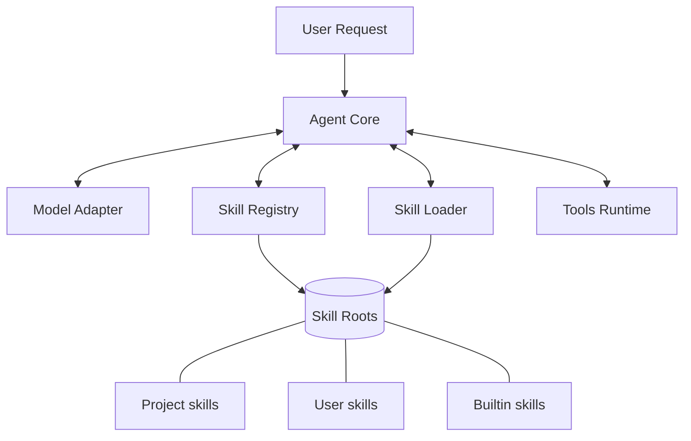
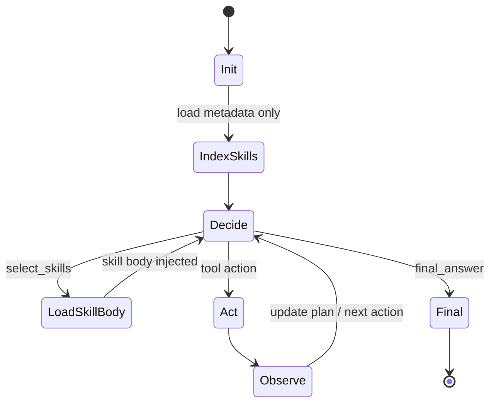
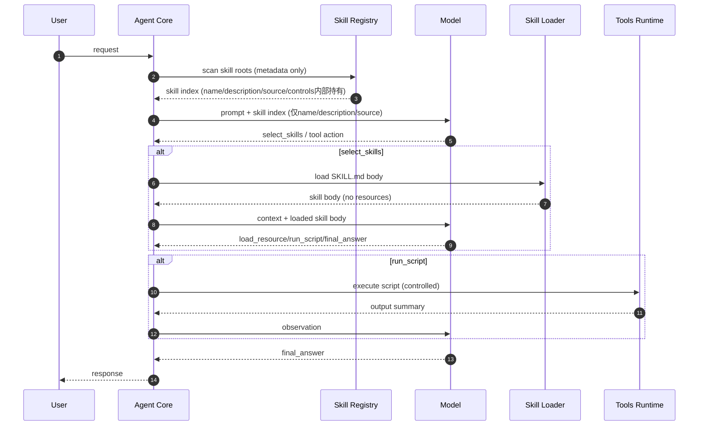

# Agent Skills 技能模式：技术方案（草案）

本方案用于实现一个支持 Agent Skills 技能模式的 Python Agent，核心定位为：

1. **学习与深入理解 Agent 系统设计**：覆盖技能发现、渐进式披露、ReAct 主循环、权限模型、上下文管理等核心机制。
2. **为特定应用场景提供轻量 Skill 运行时**：无 LangChain 等重量级框架依赖，可嵌入具体产品。

说明：本文仅为技术方案，不包含实现代码。

## 1. 目标与非目标

### 1.1 目标（Must）

- 支持技能目录结构：`<skill-root>/<skill-name>/SKILL.md` + 可选 `scripts/reference/assets`。
- 支持渐进式披露三层加载：
  - 启动仅加载 `name/description` 形成技能索引
  - 触发时加载 `SKILL.md` 正文
  - 需要时再读取 resource 或执行 scripts，并将”结果”注入上下文
- 支持多技能根目录与优先级：项目级、用户级、内置级。
- 支持权限模型（最小权限）：
  - 技能声明可用工具白名单（例如 `allowed-tools`）
  - Agent 运行时强制执行白名单与高风险动作审批
- 支持技能可组合：一次任务可触发多个技能，并有冲突与优先级规则。
- 支持容错与恢复：错误处理、重试策略、Plan 持久化与崩溃恢复。
- 支持上下文管理：token 限制下的智能裁剪与技能内容优先级管理。
- 支持资源配额：并发数、执行超时等可强制执行的约束。
- 支持可观测性：结构化事件流审计、分级日志、调试模式。

### 1.2 非目标（Not now）

- **不做技能包分发系统**（zip 安装/卸载/校验/签名）：当前阶段直接使用文件系统管理技能目录，分发能力列为后续增强。
- **不做 Evals 评估框架**：结构化回归评估（用例集/指标输出/MockModel 批跑）列为后续增强；当前阶段通过手动测试与日志审计验证正确性。
- **不做强沙箱隔离**（Python 标准库无法可靠实现 OS 级隔离）；只做”受控执行”（超时、目录隔离、命令白名单、环境清理）。
- **不绑定某一家 LLM 供应商**；提供可插拔的模型适配层（Anthropic / OpenAI-compatible / 本地模型）。

### 1.3 第三方库策略

- **允许使用**：`requests`（HTTP）、`PyYAML`（YAML 解析）、`pydantic`（结构验证）等常用轻量库。
- **禁止引入**：LangChain、LlamaIndex、AutoGPT 等重量级 Agent 框架（避免框架绑定与黑盒依赖）。
- **自行实现**：流式 JSON 解析器（调研后无合适三方库满足路径匹配 + 增量回调需求）。

## 2. 文档组织（总览 vs 子系统）

`agent-skills-tech-design.md` 作为总览文档，目标是明确：

- 关键设计选择（特别是 Agent Core 的规划与执行机制）
- 子系统边界、接口与关键约束
- 渐进式披露、权限的”标准要求”

各子系统的细化设计在以下子文档展开：

**当前阶段实现（核心链路）**：
- [Agent Core 设计](file:///Users/peng/Me/Ai/skills-agent/docs/design/agent-core.md)
- [Skill Registry 设计](file:///Users/peng/Me/Ai/skills-agent/docs/design/skill-registry.md)
- [Skill Loader 设计](file:///Users/peng/Me/Ai/skills-agent/docs/design/skill-loader.md)
- [Model Adapter 设计](file:///Users/peng/Me/Ai/skills-agent/docs/design/model-adapter.md)
- [Tools Runtime 设计](file:///Users/peng/Me/Ai/skills-agent/docs/design/tools-runtime.md)
- [Chat 会话管理与上下文工程设计](file:///Users/peng/Me/Ai/skills-agent/docs/design/chat-session.md)
- [流式输出架构设计](file:///Users/peng/Me/Ai/skills-agent/docs/design/streaming-output.md)

**后续阶段（暂不实现）**：
- [Distribution & CLI 设计](file:///Users/peng/Me/Ai/skills-agent/docs/design/distribution-cli.md) — 技能包分发与安装
- [Evals 设计](file:///Users/peng/Me/Ai/skills-agent/docs/design/evals.md) — 结构化评估与回归

## 3. 总体架构（系统视图）

系统分为 5 个核心子系统，Agent Core 负责”规划+执行”的主循环，其余子系统提供技能发现/加载、工具执行与模型对接能力。Distribution & CLI 和 Evals 为后续阶段，暂不在核心架构中体现。


```mermaid
flowchart TB
  user[User Request] --> core[Agent Core]
  core <--> model[Model Adapter]
  core <--> registry[Skill Registry]
  core <--> loader[Skill Loader]
  core <--> tools[Tools Runtime]

  registry --> roots[(Skill Roots)]
  loader --> roots

  roots --- project[Project skills]
  roots --- userroot[User skills]
  roots --- builtin[Builtin skills]
```

## 4. Agent Core 设计（重点）

本项目的目标是构建“支持 Skills 机制”的 Agent，因此 Agent Core 的设计需把以下能力作为一等公民：规划、动态更新、技能触发、渐进式披露、工具权限与审计。

### 4.1 Agent 类型选择：ReAct + 结构化动作

采用 ReAct 风格的主循环，但约束模型输出为“结构化动作”，避免自由文本指令直接驱动工具：

- Reason（思考/规划）：模型根据请求、当前状态与技能索引决定下一步
- Act（动作）：输出结构化动作（选技能/加载资源/执行脚本/结束输出）
- Observe（观察）：Agent 执行动作并把结果摘要注入上下文
- Repeat：根据新观察动态更新计划，直到满足退出条件

规划是否动态更新：是。每一轮 Observe 后都允许模型更新计划与目标分解，适配多步任务与不确定性（例如脚本执行结果、资源内容变化）。

### 4.2 Agent 主循环与状态机


```mermaid
stateDiagram-v2
  [*] --> Init
  Init --> IndexSkills: load metadata only
  IndexSkills --> Decide
  Decide --> LoadSkillBody: select_skills
  Decide --> Act: tool action
  Decide --> Final: final_answer

  LoadSkillBody --> Decide: skill body injected

  Act --> Observe
  Observe --> Decide: update plan / next action
  Final --> [*]
```

### 4.3 规划表示与约束

Agent Core 维护“运行态状态（Run State）”，用于让模型在多轮中稳定推进，且便于评估与审计。核心对象（概念层）：

- Request：用户请求（原文 + 归一化）
- SkillIndex：可用技能元数据列表（仅 name/description/source/controls）
- LoadedSkills：已加载的技能正文（按需）
- Plan：当前计划（可动态改写）
- ToolBudget：最大轮数、最大工具调用次数、最大脚本执行次数等硬约束
- AuditTrail：动作与观察的结构化记录

计划（Plan）建议采用“结构化列表 + 状态”表达，以支持动态更新与回归评估：

```json
{
  "goal": "完成用户任务",
  "steps": [
    {"id": "s1", "title": "选择并加载相关技能", "status": "pending"},
    {"id": "s2", "title": "按技能流程执行脚本或读取资源", "status": "pending"},
    {"id": "s3", "title": "自检并输出最终结果", "status": "pending"}
  ],
  "assumptions": [],
  "constraints": {"max_turns": 12, "max_tool_calls": 30}
}
```

#### 4.3.1 Plan 生命周期：何时创建、何时更新

Plan 的创建与更新依赖"提示词 + 结构化输出约束"来引导模型显式产出规划，并作为 Agent 的运行态状态保存。

- Plan 创建时机
  - `IndexSkills` 完成后进入第一次 `Decide`（第一次请求模型决策）时创建。
  - 该轮提示词会同时要求模型：生成初始 Plan（可粗粒度）+ 给出下一步结构化动作（例如 `select_skills`）。

- Plan 更新时机
  - 每一轮 `Act` 执行完产生 `Observe` 后，进入下一次 `Decide`（下一次请求模型决策）时更新。
  - `Observe` 本身不是一次对模型的请求，而是 Agent 执行工具/加载资源后的结果（observation）。更新发生在"把 observation 注入上下文后"的下一次模型调用里。

- Plan 如何更新
  - 提示词要求模型基于：当前 Plan + 最新 observation + 预算约束，输出下一步结构化动作。
  - 同时允许模型在同一响应中返回 `plan_update`（**全量替换**），用于：
    - 添加/删除/重排 steps
    - 更新 step 状态（pending/in_progress/completed）
    - 补充或修正 assumptions
    - 调整 constraints（例如预算压力下的降级策略）
  - **MVP 阶段只支持全量替换**：模型返回完整的新 Plan 对象，Agent Core 用其覆盖当前 Plan 并落盘。patch 模式（增量更新）作为后续增强项，原因：patch 格式依赖模型稳定产出语义正确的变更描述，且 Agent Core 需实现合并逻辑与冲突处理，MVP 阶段不引入此复杂度。

### 4.3.2 Plan 持久化与恢复

为支持长时运行任务与崩溃恢复，Plan 需要持久化：

- 持久化时机
  - 每次 Plan 更新后立即写入：`.agent/runs/<run-id>/plan.json`
  - 同时记录当前轮次、已执行动作、观察结果摘要

- 恢复机制
  - Agent 启动时检查是否存在未完成的 run（状态非 `completed`/`failed`）
  - 提供 `--resume <run-id>` 选项从上次断点恢复
  - 恢复时重新加载：Plan、已加载技能列表、审计记录
  - **上下文重建策略（关键）**：模型的多轮对话语义依赖完整的 message 历史，仅恢复 Plan 不足以让模型正确推进。MVP 阶段采用"压缩重建"方式：
    - 从 `events.jsonl` 读取已执行的动作序列与 observation 摘要
    - 构造一条"恢复摘要消息"注入上下文（格式：`已完成步骤 + 关键 observation + 当前 Plan`）
    - 明确标注本次为恢复执行，让模型基于摘要而非完整历史继续
  - 后续增强（非 MVP）：完整落盘每轮的 messages 原文（含 role/content），恢复时精确重建 message 列表，代价是存储翻倍但恢复语义更准确

- 清理策略
  - 默认保留最近 N 次 run（例如 10 次）
  - 提供 `runs clean` 命令手动清理

### 4.4 上下文窗口管理策略

技能正文、历史对话、观察结果可能超出模型token限制，需要智能管理：

- 优先级分层
  - P0：当前 Plan、最新观察、用户请求
  - P1：已加载技能正文（摘要形式）
  - P2：历史动作与观察（压缩摘要）
  - P3：技能索引（可按相关性裁剪）

- 裁剪策略
  - 达到阈值（例如90% context window）时触发裁剪
  - 按优先级逆序裁剪：先丢弃 P3，再压缩 P2
  - 技能正文过长时提取关键段落（标题 + 步骤编号 + 自检清单）

- 外部存储
  - 长文本资源（>2000 tokens）不全量加载，仅存摘要+路径引用
  - 提供 `recall_context` 动作让模型明确请求历史片段

### 4.5 Skills 机制在 Agent Core 中的关键连接点

1. 启动阶段只把技能元数据暴露给模型（渐进式披露 Level 1）。
2. 模型通过 `select_skills` 选择技能后，Agent Core 才加载对应技能正文并注入上下文（Level 2）。
3. 技能正文中的资源引用与脚本执行由模型通过 `load_resource/run_script` 明确请求，Agent Core 执行并把结果摘要注入上下文（Level 3）。
4. Agent Core 在每次动作执行前后都执行：
   - 权限校验（全局配置 ∩ 技能 allowed-tools ∩ 运行时策略）
   - 安全校验（路径越界、脚本超时、输出截断、资源配额）
   - 审计落盘（用于评估与回放）
   - 上下文窗口检查与智能裁剪

### 4.6 错误处理与容错机制

Agent Core 需要稳健的错误处理策略，避免单点失败导致整体崩溃：

- 模型调用失败
  - 重试策略：指数退避，最多3次
  - 降级策略：切换到备用模型（若配置）或提示用户
  - 结构化输出解析失败时请求模型重新生成（附带错误提示）

- 工具执行失败
  - 脚本执行错误：捕获 stderr，作为观察注入上下文，允许模型调整计划
  - 资源加载失败：记录错误，跳过该资源，继续执行
  - 网络超时：可重试动作（如 `load_resource` from URL）

- Plan 异常检测
  - **死循环检测（双重机制）**：
    1. **动作哈希检测**（主要机制，不依赖模型诚实性）：对最近 K 轮动作的（类型 + 关键参数）计算哈希，若出现重复模式则直接触发停止。此机制不依赖 Plan 中的 step 状态是否被模型正确更新。
    2. **Plan 进展检测**（辅助机制）：连续 N 轮 step 状态均无变化时触发告警，用于在哈希检测之前给出早期预警。
  - 预算耗尽：达到最大轮次/token时，强制要求模型输出 `final_answer`（附带未完成标记）
  - 冲突检测：模型请求禁止工具时，记录违规并拒绝执行

- 崩溃恢复
  - 每轮结束后持久化 Run State（Plan + 审计 + 上下文摘要）
  - 启动时检查未完成 run，提供恢复选项


```mermaid
sequenceDiagram
  autonumber
  participant U as User
  participant A as Agent Core
  participant R as Skill Registry
  participant M as Model
  participant L as Skill Loader
  participant T as Tools Runtime

  U->>A: request
  A->>R: scan skill roots (metadata only)
  R-->>A: skill index (name/description/source/controls内部持有)
  A->>M: prompt + skill index (仅name/description/source)
  M-->>A: select_skills / tool action
  alt select_skills
    A->>L: load SKILL.md body
    L-->>A: skill body (no resources)
    A->>M: context + loaded skill body
    M-->>A: load_resource/run_script/final_answer
  end
  alt run_script
    A->>T: execute script (controlled)
    T-->>A: output summary
    A->>M: observation
  end
  M-->>A: final_answer
  A-->>U: response
```

### 4.7 何时选择多技能与冲突处理（Agent 侧策略）

多技能允许同时选择，但 Agent Core 需要设定可控策略，避免一次性加载过多正文：

- 默认策略：每轮最多加载 N 个技能正文（例如 2~3），基于上下文窗口动态调整。
- 冲突策略：
  - 同名技能但不同 source：按优先级选择（project > user > builtin）
  - 允许模型显式指定 `source` 覆盖默认优先级
  - 提供 `--prefer-source` CLI 选项全局设置偏好
- 递进策略：
  - 先加载"协调型技能"（例如任务编排/规范），再加载"领域型技能"（例如 PDF/Excel）
  - 支持技能声明 `load-priority: high|normal|low` 影响加载顺序
- 依赖处理：
  - 技能可声明 `requires: [skill-name-1, skill-name-2]`
  - Agent Core 自动检查依赖并按依赖顺序加载
  - 循环依赖检测并拒绝加载

详细策略将在 [Agent Core 设计](file:///Users/peng/Me/Ai/skills-agent/docs/design/agent-core.md) 展开。

## 5. 目录与配置规范（概要）

详见：[Skill Registry 设计](file:///Users/peng/Me/Ai/skills-agent/docs/design/skill-registry.md)、[Distribution & CLI 设计](file:///Users/peng/Me/Ai/skills-agent/docs/design/distribution-cli.md)。

### 5.1 项目目录（建议）

```
<repo>/
  .agent/
    skills/                       # 项目级技能根目录（可提交版本库）
    config.json                   # Agent 配置（或使用 toml）
    evals/                        # 用例集（请求/期望动作/期望输出）
  docs/
    agent-skills.md
    agent-skills-tech-design.md
```

用户级技能目录（默认）：

- macOS/Linux: `~/.agent/skills/`

内置技能目录（只读）：

- `<repo>/skills_builtin/` 或随安装包资源内置

### 5.2 Skill Root 搜索顺序（优先级）

默认优先级（高→低）：

1. 项目级：`<repo>/.agent/skills/`
2. 用户级：`~/.agent/skills/`
3. 内置级：安装包自带

同名技能冲突策略：

- 默认选择更高优先级的技能。
- 提供 `--source project|user|builtin` 覆盖选择。
- 允许命名空间：`org/skill-name`（可选增强）。

### 5.3 配置文件（纯原生）

优先选择 JSON（标准库原生支持）：

- `.agent/config.json`
- 支持字段（示例）：
  - `skill_roots`: `[".agent/skills", "~/.agent/skills"]`
  - `model`: `{ "provider": "mock", "params": { ... } }`
  - `execution`: `{ "require_approval_for": ["write_file","run_script","network"] }`
  - `security`: `{ "max_skill_body_lines": 500, "block_angle_brackets_in_frontmatter": true }`

如需 TOML，可要求 Python 3.11+ 并使用 `tomllib`（只读）。

## 6. 技能格式规范（SKILL.md）（概要）

详见：[Skill Loader 设计](file:///Users/peng/Me/Ai/skills-agent/docs/design/skill-loader.md)、[Skill Registry 设计](file:///Users/peng/Me/Ai/skills-agent/docs/design/skill-registry.md)。

### 6.1 YAML 前言字段（子集）

必须字段：

- `name: <string>`
- `description: <string>`

常用可选字段（建议支持）：

- `version: <string>`：技能版本（语义化版本，例如 `1.2.0`）
- `author: <string>`：作者信息
- `disable-model-invocation: <bool>`：从技能索引中隐藏（不允许模型自动触发）
- `user-invocable: <bool>`：是否在 UI/CLI 列表展示为可直接调用
- `allowed-tools: <list|string>`：允许工具白名单（如 `["read_file","grep","run_script"]`）
- `run-mode: inline|subagent`：**MVP 阶段预留字段，当前版本行为等同 inline，subagent 模式（独立 Agent 实例执行）为后续阶段设计，实现前请忽略此字段。**
- `requires: <list>`：依赖的其他技能（例如 `["base-utils", "json-parser"]`）
- `load-priority: high|normal|low`：加载优先级（默认 normal）
- `resource-limits`：资源配额约束
  - `max-script-time-sec: <int>`：单脚本最大执行时间（秒）— **强制执行**：通过 subprocess 超时机制可靠终止
  - `max-concurrent-scripts: <int>`：最大并发脚本数 — **强制执行**：通过信号量（semaphore）控制
  - `max-memory-mb: <int>`：最大内存使用（MB）— **尽力约束**：Python 在 macOS 上无法可靠限制子进程内存（`resource.setrlimit` 对内存在 macOS 无效），仅作审计参考，**不应作为安全边界依赖**
  - `allow-network: <bool>`：是否允许网络访问 — **尽力约束**：可通过环境变量或 proxy 设置施加软限制，但无 OS 级隔离保障

解析实现：

- 使用 **`PyYAML`**（`yaml.safe_load`）解析前言区，`safe_load` 禁止 Python 对象反序列化，安全性有保证。
- 解析后对字段做白名单校验：只提取已知字段，未知字段忽略；类型不符直接拒绝加载该技能并记录错误。

解析约束（安全）：

- 前言区禁止 `<` `>`（降低提示词注入风险），在 `safe_load` 之前做字符串预检。
- 仅信任标量与简单列表值；若已知字段的值为复杂嵌套结构，拒绝加载。

### 6.2 正文结构建议（供技能作者）

为提升可执行性与评估性，建议技能正文至少包含：

- 目标（Goal）
- 输入输出（IO Contract）
- 步骤（Steps，编号）
- 失败处理（Failure Modes）
- 自检/验收（Checklist）
- 资源索引（Resources）

## 7. 渐进式披露实现细节（概要）

详见：[Skill Loader 设计](file:///Users/peng/Me/Ai/skills-agent/docs/design/skill-loader.md)、[Agent Core 设计](file:///Users/peng/Me/Ai/skills-agent/docs/design/agent-core.md)。

### 7.1 启动阶段（Level 1：元数据常驻）

- 扫描 skill roots，找到所有 `<skill-name>/SKILL.md`。
- 仅解析 YAML 前言，提取 `name/description`（以及必要控制字段）。
- 构建 Skill Index（Agent Core 内部完整版）：
  - `skill_id`（来源+名称+版本）
  - `name`
  - `description`
  - `source`（project/user/builtin）
  - `path`
  - `controls`（disable-model-invocation、allowed-tools 等）— **仅 Agent Core 内部使用**

向模型暴露的内容只包含”可用技能列表（name + description + source）”，**不包含 controls 字段**（`allowed-tools` 等权限信息由 Agent Core 在执行侧校验，不进入模型输入上下文，以防模型受提示词注入诱导优先选择高权限技能）。

### 7.2 触发阶段（Level 2：加载正文）

当模型选择某技能后：

- 读取 `SKILL.md` 正文（去除前言）。
- 执行加载策略：
  - 默认限制最大行数（例如 500 行），超限要求拆分到 reference 文件或拒绝加载。
  - 可做轻量净化：移除不可见字符、规范化换行。
- 将正文作为“技能说明”注入上下文，并带上技能来源与路径信息。

### 7.3 执行阶段（Level 3：资源按需）

当技能步骤需要更多细节时：

- 读取 reference/assets 中的特定文件（仅在被明确请求时）。
- 执行 scripts：
  - 受控参数、受控工作目录、超时、输出截断、环境变量清理。
  - 仅把脚本输出（stdout/stderr 摘要）注入上下文。

关键点：资源内容不应被无差别地全部读入上下文；以"精确文件+精确片段"为主。

## 8. 模型交互协议（结构化动作）（概要）

详见：[Model Adapter 设计](file:///Users/peng/Me/Ai/skills-agent/docs/design/model-adapter.md)、[Agent Core 设计](file:///Users/peng/Me/Ai/skills-agent/docs/design/agent-core.md)。

为保证可控、可评估、可回归，Agent 与模型之间使用"结构化动作输出协议"，模型不得直接输出自由形态的工具调用指令。

### 8.1 动作类型（建议最小集合）

- `select_skills`：选择要加载的技能（可多选）
- `load_resource`：读取技能资源文件（reference/assets）
- `run_script`：执行技能脚本
- `final_answer`：输出最终答复

### 8.2 动作载荷（示例结构，非代码）

- `select_skills`:
  - `skills`: `[{"name": "...", "source": "project|user|builtin"}]`
  - `reason`: `"..."`

- `load_resource`:
  - `skill`: `{name, source}`
  - `relative_path`: `"reference/kpi.md"`
  - `section_hint`: `"## 指标定义"`（可选）

- `run_script`:
  - `skill`: `{name, source}`
  - `relative_path`: `"scripts/aggregate.py"`
  - `args`: `["--input","..."]`

Agent Core 负责校验动作合法性（路径是否在技能目录内、工具是否允许、是否需要审批等）。

### 8.3 结构化输出实现机制

模型必须输出结构化动作，需要明确采用的约束机制：

- **首选：模型原生 tool use / function calling**
  - 将动作类型定义为"工具声明"（tool schema），由模型选择调用哪个工具并填充参数
  - 优势：模型原生支持，输出格式有 provider 保障，重试更稳定
  - 适用：Anthropic（tool_use）、OpenAI（function calling）等支持 tool use 的模型

- **次选：JSON mode（response_format: json_object）**
  - 系统提示中附加 JSON schema 约束，要求模型严格输出合法 JSON
  - 适用：支持 JSON mode 但不支持 tool use 的模型（或本地模型）
  - 注意：需在 Model Adapter 层做 JSON schema 校验与解析失败重试

- **不推荐：纯 prompt 约束**
  - 仅靠提示词要求模型输出 JSON，无 provider 级格式保障
  - 适用：MockModel 内部测试，或作为降级兜底（可靠性最低，需增加重试次数）

**MockModel**（用于离线测试）固定按用例文件中的动作序列返回，与上述机制解耦，不受限于 provider 能力。

## 9. 工具与权限模型（概要）

详见：[Tools Runtime 设计](file:///Users/peng/Me/Ai/skills-agent/docs/design/tools-runtime.md)。

### 9.1 工具分类

- 低风险：`read_file`, `list_dir`, `grep`（只读）
- 中风险：`run_script`（本地执行）
- 高风险：`write_file`, `network_request`, `delete_file`（破坏性/外联）

### 9.2 权限来源（合并规则）

最终允许工具集合 = 全局配置允许 ∩ 技能 allowed-tools（如存在） ∩ 运行时策略

策略例：

- 全局默认仅允许只读工具，执行脚本/写文件必须显式开启。
- 技能声明 allowed-tools 进一步收紧权限。

### 9.3 审批机制（交互式/非交互式）

- 交互式：命令行提示用户批准（支持 `--yes` 禁止默认通过）。
- 非交互式：CI/批处理模式下，遇到需审批工具直接失败并给出可重放命令。

### 9.4 审计与可追溯

每次执行记录：

- 请求摘要、选择的技能、加载的资源、调用的工具、脚本退出码、关键输出摘要。
- 记录位置：`.agent/runs/<timestamp>/run.json`（建议）。

## 10. 分发与安装方案（后续阶段，暂不实现）

> 当前阶段技能目录直接通过文件系统管理（手动复制 / git clone）。zip 包安装/卸载/签名校验等功能列为后续增强。详细设计保留于：[Distribution & CLI 设计](file:///Users/peng/Me/Ai/skills-agent/docs/design/distribution-cli.md)。

## 11. 评估与回归 Evals（后续阶段，暂不实现）

> 当前阶段通过手动测试与事件流日志（`events.jsonl`）审计正确性。结构化用例集、精确指标输出与 MockModel 批量回归列为后续增强。详细设计保留于：[Evals 设计](file:///Users/peng/Me/Ai/skills-agent/docs/design/evals.md)。
>
> **MockModel**（用于阶段 A 骨架验证）仍在当前阶段实现，但其唯一目标是按配置序列驱动 Agent 主循环，不涉及评分与回归报告。

## 12. 会话管理与多轮对话上下文工程

多轮对话涉及两个层面：

- **Agent 内部多轮**（已设计于 Section 4）：单次任务内的 ReAct 循环，由 Agent Core 管理。
- **用户侧多轮**（本节）：用户在收到 `final_answer` 后继续提问，需要跨任务的会话记忆与上下文管理。

详细设计见：[Chat 会话管理与上下文工程设计](file:///Users/peng/Me/Ai/skills-agent/docs/design/chat-session.md)

### 12.1 运行模式

CLI 支持两种模式：

```bash
skills-agent run "query"   # 单次模式：无会话记忆，每次独立执行
skills-agent chat          # 会话模式：维护多轮对话，直到用户主动退出
```

两种模式共用同一个 `AgentCore`，区别仅在外层循环是否持续读取用户输入。

### 12.2 上下文组装策略（三层结构）

每次新用户请求到来时，按以下层次构建 messages 发给模型：

```
┌──────────────────────────────────────────────────┐
│ 系统层（永不压缩，每次重建）                          │
│   • 系统 prompt（Agent 角色说明）                   │
│   • 当前技能索引（list_model_views() 实时生成）       │
├──────────────────────────────────────────────────┤
│ 历史摘要层（有压缩历史时存在）                         │
│   • 一条 user-role 消息，格式：                      │
│     <summary>历史：用户曾问了...，Agent 做了...，      │
│     结论是...</summary>                             │
├──────────────────────────────────────────────────┤
│ 近期原文层（最近 K 轮完整对话，默认 K=3）              │
│   • Turn N-2: user / assistant                   │
│   • Turn N-1: user / assistant                   │
├──────────────────────────────────────────────────┤
│ 当前层                                             │
│   • 本轮用户输入                                    │
└──────────────────────────────────────────────────┘
```

关键约束：
- 技能索引**每轮重建**（不缓存，技能目录可能在会话期间变化）
- 历史摘要只保存"结果性事实"，不保存 ReAct 内部细节
- 近期原文窗口 K 默认 3，可通过 `config.json` 调整

### 12.3 压缩策略

**触发条件**：`estimated_tokens(recent_turns) > context_limit × 25%`

**执行**：取最旧 M 轮 → 独立调用模型生成 150 字摘要 → 追加到 `compressed_summary` → 从 `recent_turns` 移除。

会话状态持久化于 `.agent/sessions/<session-id>/`（session.json / context.json / conversation.jsonl）。

---

## 13. 流式输出架构

输出系统需同时满足 CLI 终端实时输出与未来 API 流式推送两个场景，且**不要求修改 Agent Core 代码**即可扩展。

详细设计见：[流式输出架构设计](file:///Users/peng/Me/Ai/skills-agent/docs/design/streaming-output.md)

### 13.1 核心抽象：OutputSink

```python
class OutputSink:
    """基类，所有方法空实现。子类只需覆盖关心的方法。"""

    def on_progress(self, action: str, detail: str = "") -> None: ...
    def on_plan_updated(self, plan: Plan) -> None: ...
    def on_text_chunk(self, chunk: str, done: bool) -> None: ...
    def on_observation(self, source: str, content: str) -> None: ...
    def on_error(self, message: str, recoverable: bool = True) -> None: ...
    def on_session_end(self, turn_count: int, status: str) -> None: ...

NullSink = OutputSink   # 空实现即为 NullSink（测试用）
```

### 13.2 实现层次

| 实现 | 场景 | 阶段 |
|------|------|------|
| `NullSink` | 测试，零副作用 | Phase A |
| `CLISink` | 终端实时输出（进度→stderr，答案→stdout） | Phase A |
| `SSESink` | HTTP SSE 推送，未来 API 服务 | Phase C |

### 13.3 Agent Core 集成

`AgentCore` 构造时接受 `sink: OutputSink = None`，默认 `NullSink()`。与输出方式完全解耦：

```
CLI:    AgentCore(sink=CLISink())
API:    AgentCore(sink=SSESink(response_stream))
Test:   AgentCore(sink=NullSink())  # 或 RecordSink()
```

Phase C 起，`AnthropicAdapter` 通过 `StreamingJSONParser` 的 `$.final_answer.content` 回调将答案流式传给 `sink.on_text_chunk(chunk, done)`，实现逐字打印。

---

## 14. 分阶段交付

### 阶段 A：核心链路打通（技能发现 → 加载 → Agent 主循环 → 工具执行 → CLI 输出）

目标：无真实 LLM 依赖，跑通完整骨架，所有核心子系统可独立测试，执行过程有实时进度输出。

- **Skill Registry**：扫描 skill roots，用 `PyYAML safe_load` 解析 SKILL.md 前言，构建 SkillIndex（内部层 + 模型可见层分离）
- **Skill Loader**：渐进式披露三层加载（元数据 / 正文 / 资源片段），路径越界校验，正文行数截断
- **Agent Core 主循环**：ReAct + 显式 Plan（全量替换），状态机（Init → IndexSkills → Decide → Observe → Final），事件流输出
- **MockModel**：按配置文件固定输出动作序列，用于骨架验证（无需真实 API）
- **Tools Runtime（只读）**：`read_file` / `list_dir` / `grep`，权限合并（全局 ∩ allowed-tools），审计落盘
- **OutputSink + CLISink**：进度行实时打印到 stderr，最终答案到 stdout，支持 `--verbose`
- **CLI**：`run`（单次执行）、`chat`（交互式多轮，会话存储到 `.agent/sessions/`）、`skills list`、`skills inspect`

### 阶段 B：执行能力、安全策略与会话管理

目标：接入真实工具执行，完善权限管控与稳健性，实现多轮对话上下文压缩。

- **run_script 受控执行**：subprocess 超时（`max-script-time-sec` 强制），工作目录隔离，stdout/stderr 截断，并发信号量（`max-concurrent-scripts`）
- **审批机制（交互式）**：高风险动作 CLI 提示（`--yes` 自动通过，CI 模式下直接失败）
- **allowed-tools 强制**：拒绝技能未声明的工具，记录违规事件
- **上下文裁剪**：按 P0-P3 优先级在接近 `max_context_chars` 时触发压缩
- **崩溃恢复**：Run State 每轮落盘，`--resume` 从 events.jsonl 重建上下文
- **ConversationCompressor**：超阈值时压缩最旧 M 轮为摘要，防止 chat 模式 context 无限膨胀

### 阶段 C：真实模型接入与流式输出

目标：接入真实 LLM，实现流式文本输出，完成端到端验证。

- **Model Adapter（Anthropic）**：用 `requests` 调用 Anthropic Messages API，tool use 实现结构化动作输出，指数退避重试
- **流式 JSON 解析器**：手写 FSM，支持 `$.action.type` / `$.final_answer.content` 等路径的增量回调
- **流式输出接入**：`StreamingJSONParser` 的 `$.final_answer.content` 回调驱动 `CLISink.on_text_chunk()`，实现逐字打印
- **SSESink**：实现 HTTP SSE 格式输出接收器，供未来 API 服务无缝接入
- **结构化输出降级**：tool use → JSON mode → prompt-only 的优先级选择逻辑

---

## 15. 验收标准（Definition of Done）

### 阶段 A 验收

- 在空项目中放入若干技能目录后，`skills list` 仅读取前言元数据即可列出技能索引，不读取正文。
- MockModel 驱动 Agent 主循环时，Agent 仅在被 `select_skills` 选中的技能上加载正文；未触发技能正文不读入上下文。
- 资源文件不会被默认加载；仅在 `load_resource` 动作发生时读取对应文件。
- `skills inspect <name>` 正确展示技能元数据（前言字段），不展示正文。
- 事件流可在 `events.jsonl` 中完整回放每轮动作与 observation。
- `skills-agent run "test"` 执行时 stderr 可见进度行（`→ load_skill: xxx`），stdout 只有最终答案。
- `skills-agent chat` 支持至少 3 轮连续追问，第 2 轮起历史消息正确传入 AgentCore。

### 阶段 B 验收

- `run_script` 执行超时后被强制终止，timeout observation 正确注入上下文。
- 技能 `allowed-tools` 白名单生效：技能未声明的工具调用被拒绝并记录违规事件。
- 高风险动作在交互式模式下提示审批；`--yes` 模式下自动通过；CI 模式下直接失败并输出可重放命令。
- 上下文超过阈值时触发裁剪，裁剪后 Plan 与最近 observation 保持完整。
- 10 轮对话后触发历史压缩，`compressed_summary` 非空，`recent_turns` 长度不超过 `K*2`。

### 阶段 C 验收

- 用真实 Anthropic API 运行包含 `select_skills` + `load_resource` + `final_answer` 的完整任务，进度实时显示在 stderr。
- 流式 JSON 解析器在模型逐 token 返回时，正确提取 `action.type` 并尽早触发。
- 最终答案**逐字打印**（非等待完整响应），`on_text_chunk` 在生成过程中多次触发。
- `SSESink` 单元测试通过，每个 SSE 事件格式符合规范（`data: {...}\n\n`）。
- 结构化输出解析失败时触发重试（最多 3 次），超限后降级为错误 observation。
