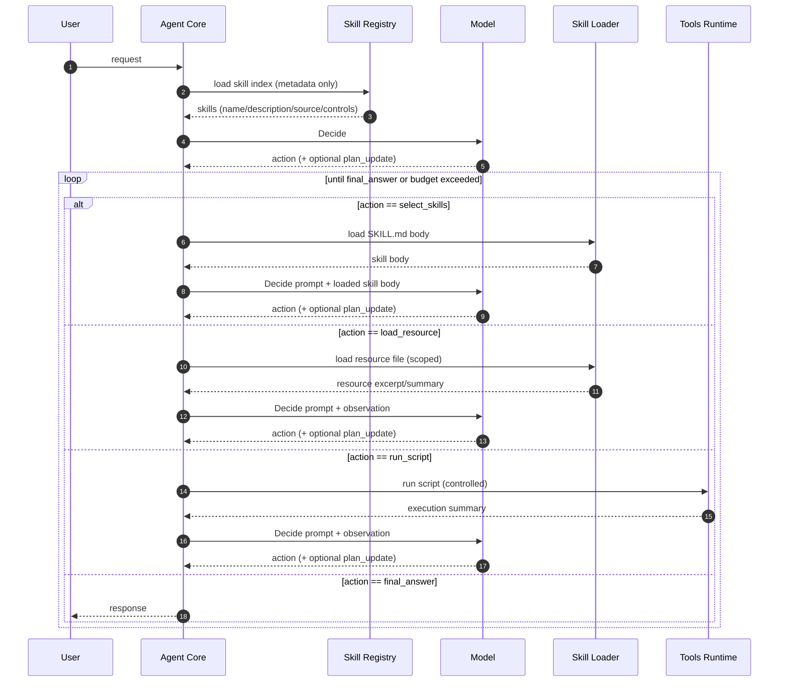
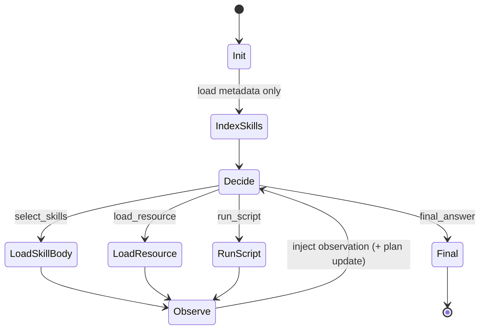

# Agent Core 设计

本文档细化 Agent Core 的设计：规划机制、ReAct 主循环、技能触发策略、上下文组织、动态计划更新、错误恢复、预算与退出条件，以及与 Skill Registry / Skill Loader / Tools Runtime / Model Adapter 的接口契约。

总览参见：[agent-skills-tech-design.md](file:///Users/peng/Me/Ai/skills-agent/docs/agent-skills-tech-design.md)。

## 1. 设计目标

- 提供稳定的多轮执行主循环，支持动态规划与可回放审计
- 把 Skills 机制作为一等能力：技能发现、选择、渐进式披露、资源按需加载
- 把安全与可控作为一等约束：最小权限、审批、预算限制、失败降级
- 支持评估与回归：在 MockModel 下离线重放动作序列并判分

## 1.1 Agent Core 的系统定位（中枢）

Agent Core 是整个程序的核心中枢（orchestrator），职责是把“模型决策、技能系统、工具执行、输出回显、落盘审计”串成一个可控的执行流水线：

- 输入侧：接收用户请求（CLI/服务端），初始化 Run State 与预算
- 决策侧：通过 Model Adapter 发起 `Decide` 请求，拿到结构化动作与（可选）Plan 更新
- 执行侧：对动作做校验与路由，委派给 Skill Loader / Tools Runtime，并收集 observation
- 观测侧：把执行过程以事件流方式对外输出（控制台、HTTP/SSE/WebSocket 等）
- 审计侧：将关键事件与产物落盘，支持回显、回放与评估

## 2. Agent 运行模型（ReAct + 显式 Plan）

### 2.1 为什么是 ReAct + 显式 Plan

- ReAct 负责“循环骨架”：Reason → Act → Observe → Repeat
- Plan 是 ReAct 循环中的“显式状态”：把目标拆成 steps，记录假设与约束，使多轮推进更稳定、可控、可评估
- Skills 机制要求严格的“按需加载”，显式 Plan 有助于抑制模型一次性加载过多技能/资源

### 2.2 关键原则

- 每一轮只允许一次模型调用（一次 Decide）：模型在同一响应中完成“是否更新 Plan + 输出下一步结构化动作”
- Observe 不是模型调用：Observe 是 Agent 执行动作后的结果（observation），注入上下文后进入下一轮 Decide
- 模型不能直接执行工具：必须输出结构化动作，由 Agent Core 校验后委派给 Tools Runtime / Skill Loader

### 2.3 Plan 与 ReAct 的配合方式（执行视角）

- Plan 创建：在 `IndexSkills` 后第一次 `Decide` 的提示词中要求模型产出初始 Plan（通常粗粒度）并给出下一步动作
- Plan 更新：每次动作执行后的 observation 被注入上下文，在下一次 `Decide` 中由模型更新 Plan（全量或 patch）
- 计划与动作解耦：Plan 是“你打算怎么做”，结构化动作是“你下一步做什么”；Agent Core 每轮只执行一个动作，以 observation 驱动下一轮改计划

## 3. 总体时序与状态机

### 3.1 时序（含渐进式披露）



### 3.2 状态机（Agent Core 视角）



## 4. Run State（运行态状态）数据模型

Agent Core 维护 Run State，驱动整个多轮执行过程并用于审计与回放。

### 4.1 核心字段（概念层）

- Request：用户请求（原文 + 归一化）
- SkillIndex：技能元数据列表（name/description/source/controls）
- LoadedSkills：已加载技能正文的集合（按需）
- Plan：当前计划（可动态改写）
- Budget：执行预算与限制（max_turns/max_tool_calls/max_script_runs/max_context_chars）
- Context：对话上下文（system+developer+user+observations+skill bodies）
- AuditTrail：动作与观察的结构化记录（可落盘）

### 4.2 Plan 结构（建议）

```json
{
  "goal": "完成用户任务",
  "steps": [
    {"id": "s1", "title": "选择并加载相关技能", "status": "pending"},
    {"id": "s2", "title": "执行技能流程并收集结果", "status": "pending"},
    {"id": "s3", "title": "自检与输出", "status": "pending"}
  ],
  "assumptions": [],
  "constraints": {
    "max_turns": 12,
    "max_tool_calls": 30,
    "max_script_runs": 6
  }
}
```

### 4.3 Plan 生命周期

- 创建：`IndexSkills` 完成后的第一次 `Decide` 中，由提示词要求模型同时产出初始 Plan + 下一步动作
- 更新：每次执行动作产生 observation 后的下一次 `Decide` 中，模型基于“当前 Plan + 新 observation + 预算”更新 Plan
- 表达：支持两种方式
  - 全量替换：`plan` 字段返回完整新计划
  - 增量更新：`plan_update` 以 patch 形式描述变更（便于审计与评估）

## 4.4 对外输出：事件流（实时回显）

执行过程对外输出建议采用“事件流”（event stream）而不是直接打印日志字符串。Agent Core 在关键节点产出结构化事件，由不同输出后端消费：

- 控制台：实时打印简化版事件（适合 CLI）
- 文件：JSONL 逐行写入（适合回放/审计/评估）
- 服务端：以 SSE/WebSocket/HTTP chunked streaming 向客户端推送事件（适合 UI）

事件粒度建议覆盖：

- Run 级：`run_started` / `run_finished`
- Turn 级：`turn_started` / `turn_finished`
- 模型级：`model_request` / `model_response`（不记录敏感原文时可只记录摘要与哈希）
- 动作级：`action_planned` / `action_validated` / `action_executed`
- 观察级：`observation_recorded`
- 计划级：`plan_created` / `plan_updated`
- 审批级：`approval_required` / `approval_granted` / `approval_denied`

建议事件格式（示意）：

```json
{
  "ts": "2026-02-03T12:34:56.789Z",
  "run_id": "20260203_123456_abcd",
  "turn": 3,
  "type": "action_executed",
  "data": {
    "action": "run_script",
    "skill": {"name": "pdf-form-filler", "source": "project"},
    "relative_path": "scripts/fill.py",
    "result": {"exit_code": 0, "stdout_chars": 1823}
  }
}
```

说明：

- “实时传输出执行过程”本质是流式输出事件，不强依赖模型 token 级流式输出；即使模型不支持逐 token streaming，事件流仍可完整回显“在做什么、做到哪一步、结果如何”。
- 理想情况下支持 token 级流式输出：在模型以“结构化 JSON”格式输出动作的前提下，通过流式解析 JSON 字符流实现增量回显，从而同时满足“结构化可控”与“token 级体验”。

### 4.5 Token 级流式输出：结构化 JSON 的流式解析

目标：Agent Core 每次 `Decide` 的模型输出结构固定（JSON schema 固定），因此可以让模型以 JSON（或 JSON + SSE）流式返回。Agent Core 边接收边解析，尽早得到：

- action 的关键字段（例如 action.type、skill.name 等），用于尽早回显“正在做什么”
- 字符串字段的增量（例如 final_answer 的文本），用于 token 级体验（delta events）

推荐采用“手写有限状态机 + 路径匹配”的流式 JSON 解析器，能力要点：

- 输入：chunk 字符流（SSE data 段或 HTTP chunked body）
- 增量解析：逐字符状态机，维护对象/数组栈、当前 path、缓冲区
- 路径匹配：按 JSONPath 风格（例如 `$.action.type` / `$.final_answer.content` / `$.plan_update.steps[*].title`）触发回调
- 两种回调模式：
  - realtime：解析过程中实时回调
  - incremental：对字符串值只发送新增片段（delta），避免重复发送完整字符串

事件映射建议：

- 解析到 `$.action.type`：产出 `action_planned`（或 action_partial）事件
- 解析到 `$.action.*` 关键字段逐步齐全：产出 `action_validated` 之前的“预回显”事件
- 解析到 `$.final_answer` 的字符串字段：以 `assistant_delta` 事件持续输出增量文本
- 当 JSON 根对象闭合：产出 `model_response` 完整对象，进入动作校验与执行

边界与约束：

- 如果流式 JSON 最终校验失败（不闭合/非法），Agent Core 必须回退到“本轮失败”处理：记录审计并触发降级或重试
- 解析器只负责“提取字段并发事件”，最终动作仍必须通过完整 JSON 校验与 Guardrails
- streaming 只影响回显与体验，不改变 Agent Core 的单轮语义：每轮仍是一条动作（+可选 plan_update）

## 5. 结构化动作协议（Agent Core 侧约束）

动作协议的完整定义由 [model-adapter.md](file:///Users/peng/Me/Ai/skills-agent/docs/design/model-adapter.md) 展开；Agent Core 关注的是“允许哪些动作、何时允许、如何校验、如何执行”。

### 5.1 动作类型（最小集合）

- `select_skills`：选择要加载的技能（可能多选，但需受控）
- `load_resource`：读取技能资源文件（reference/assets）
- `run_script`：执行技能脚本（scripts）
- `final_answer`：输出最终答复

### 5.2 动作守卫（Guardrails）

- `select_skills`
  - 禁止选择 `disable-model-invocation: true` 的技能（除非用户显式指定并允许）
  - 每轮最多加载 N 个技能正文（默认 1~2），超过则拒绝并要求模型分批

- `load_resource`
  - `relative_path` 必须落在已选择技能目录内
  - 默认只读取必要片段或做摘要（避免把整本手册塞进上下文）

- `run_script`
  - 必须在技能目录内且路径受控
  - 必须通过 Tools Runtime 权限合并与审批（见 tools-runtime.md）
  - 必须有超时与输出截断

## 6. 技能选择策略（Skills-first 的规划落地）

### 6.1 选择顺序（递进策略）

默认策略（可配置）：

1. 先选择“工作流/规范型技能”（例如代码评审规范、报告格式规范）
2. 再选择“领域能力型技能”（例如 PDF/Excel/数据库操作）
3. 如果需要外部操作（脚本/写文件/网络），优先选择包含自检与验收步骤的技能

### 6.2 同名技能冲突处理

- 默认：按 Skill Root 优先级选择（project > user > builtin）
- 显式覆盖：模型可指定 source，Agent Core 校验合法性后执行

### 6.3 防止过早加载

- 模型只能看到技能索引（name/description），看不到正文
- 要求模型解释选择原因（reason），并鼓励“先加载一个最相关技能，再迭代”

## 7. 上下文组织（Context Packing）

### 7.1 注入层级（对应渐进式披露）

- Level 1：技能索引（只含 name/description/source/controls）
- Level 2：已加载的 SKILL.md 正文（仅被选择的技能）
- Level 3：资源片段/脚本输出摘要（仅在动作请求后）

### 7.2 上下文分区建议

Agent Core 在构造模型输入时按固定分区拼装，以便评估、调试与稳定性：

- System/Developer：全局规则、安全约束、动作协议
- User Request：原始请求
- Run State Summary：当前 Plan、预算剩余、已加载技能列表
- Skills Index：可用技能元数据
- Loaded Skills：已加载技能正文（可裁剪）
- Observations：工具/脚本/资源读取结果（摘要 + 指向来源）

### 7.3 控制上下文长度：避免循环累积过长

ReAct 主循环天然会累积“对话历史 + 技能正文 + 工具输出”，Agent Core 需要提供上下文裁剪与压缩策略，避免 token 持续增长导致性能下降或超窗。

建议采用“分层上下文 + 可丢弃策略”：

1. 不可丢弃（短且关键）
   - 用户请求（原文）
   - 当前 Plan 摘要（goal + 当前 step + 约束）
   - 预算剩余（turn/tool/script）
   - 已加载技能列表（名称+source，避免重复加载）

2. 可裁剪（按上限保留）
   - 近期 N 轮 observations（保留摘要，丢弃大块原始输出）
   - 已加载技能正文（保留必要段落；其余以“引用路径 + 章节标题”代替）

3. 可替换为摘要（超过阈值触发）
   - 历史 observations：压缩成“发生了什么 + 关键结论 + 指向产物/文件路径”
   - 历史决策：压缩成“为什么这么选技能/为什么走这条路径”

触发与执行方式：

- 触发：当 `max_context_chars`（或估算 token）接近上限时触发 compaction
- 执行：优先使用确定性规则裁剪（例如输出截断、保留尾部、保留关键字段）
- 允许增强：在不调用工具的前提下增加一次“压缩上下文”的模型调用，用于生成更高质量摘要，但必须计入预算与审计

核心原则：裁剪/摘要不应破坏 Skills 的“可追溯性”，被丢弃的内容应通过“指向落盘文件/事件 id”保持可回放。

## 8. 预算与退出条件

### 8.1 预算（Budget）

预算用于将 Agent Core 从“可能发散的多轮对话”约束为“可验证的执行过程”：

- `max_turns`：最大 Decide 轮数
- `max_tool_calls`：最大工具调用次数
- `max_script_runs`：最大脚本执行次数
- `max_context_chars`：上下文大小上限（近似控制）

### 8.2 退出条件（Stop Conditions）

- 模型输出 `final_answer`
- 预算耗尽：输出降级答复（包含已完成部分、下一步建议、阻塞原因）
- 连续失败：同一动作类型或同一工具失败超过阈值，触发降级/停止

## 9. 错误处理与恢复策略

### 9.1 工具失败

- 失败被记录为 observation，模型在下一次 Decide 中决定重试/改路径/降级
- Agent Core 可提供“自动重试上限”作为硬约束（例如网络/脚本最多重试 1 次）

### 9.2 脚本执行异常

- 超时：直接终止并产出超时 observation
- 非 0 退出码：记录 stdout/stderr 摘要 + exit_code，要求模型走失败分支或请求更换方案

### 9.3 权限拒绝 / 需要审批

- 将“拒绝原因 + 可重放请求”作为 observation
- 模型应更新 Plan（插入“请求审批/改用只读方案/输出建议”）

## 10. 审计与可回放（Evals 依赖）

Agent Core 输出的 AuditTrail 建议包含：

- 每轮 Decide 的模型输出（动作 + plan_update）
- 每次动作的输入参数、校验结果、执行耗时、输出摘要
- 预算变化与停止原因

评估侧可用同一份审计数据进行：

- 动作序列合规判分（必须先 select_skills 才能 load_resource/run_script）
- 预算合规判分
- 安全策略命中判分

### 10.1 落盘策略（Run Directory）

为支持回显、可回放与审计，Agent Core 在每次 run 创建独立目录并将“事件流 + 关键快照 + 产物”落盘。建议结构：

```
.agent/runs/<run_id>/
  events.jsonl              # 事件流（逐行 JSON，便于 tail/流式回放）
  state.json                # Run State 快照（可选：每轮覆盖写）
  final.md                  # 最终输出（如有）
  inputs/
    request.txt             # 原始输入（可选：脱敏后）
  artifacts/                # 工具/脚本产物归档（可选）
  observations/             # 大块输出单独存文件，events 仅存引用
```

落盘原则：

- `events.jsonl` 是事实来源（source of truth），用于回放与审计
- 大块内容（脚本 stdout、resource 全文片段）不直接塞进事件 data，可落到 `observations/` 并在事件里存文件引用与哈希
- 脱敏优先：对可能含敏感信息的字段存 hash/摘要，必要时提供配置开关允许保存原文

### 10.2 回放（Replay）与回显（Playback）

- 回显：客户端或 CLI 订阅事件流实时显示进度；历史回显从 `events.jsonl` 顺序重放
- 回放：评估/审计工具读取 `events.jsonl`，重建 turn 序列与动作链，验证合规性与复现实验
- 关键好处：即便上下文做了裁剪，完整过程仍可通过“事件 + 大块落盘内容引用”重建

## 11. 与其他子系统的接口契约（概要）

### 11.1 Skill Registry

参见：[skill-registry.md](file:///Users/peng/Me/Ai/skills-agent/docs/design/skill-registry.md)。

- 输入：skill roots
- 输出：SkillIndex（元数据集合）
- 约束：启动阶段只返回元数据，不读取正文

### 11.2 Skill Loader

参见：[skill-loader.md](file:///Users/peng/Me/Ai/skills-agent/docs/design/skill-loader.md)。

- `load_skill_body(skill_ref) -> text`
- `load_resource(skill_ref, relative_path, section_hint?) -> excerpt/summary`
- 约束：路径必须在技能目录内；正文/资源大小受控

### 11.3 Tools Runtime

参见：[tools-runtime.md](file:///Users/peng/Me/Ai/skills-agent/docs/design/tools-runtime.md)。

- `run_script(skill_ref, relative_path, args) -> exec_summary`
- 约束：权限合并、审批、超时、输出截断、审计

### 11.4 Model Adapter

参见：[model-adapter.md](file:///Users/peng/Me/Ai/skills-agent/docs/design/model-adapter.md)。

- `chat(messages, schema) -> structured_action`
- 约束：结构化解析、重试、纠错与 MockModel 支持
