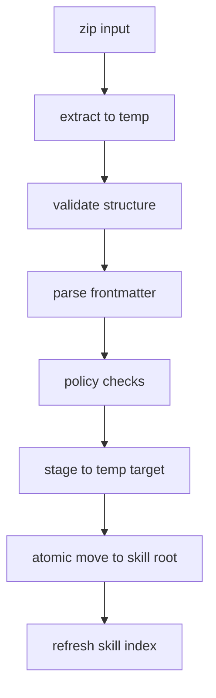

# Distribution & CLI 设计

本文档细化技能分发与命令行（Distribution & CLI）的设计：技能包格式、安装/卸载/校验、技能导出、索引刷新、以及与 Skill Registry 的一致性与可回放策略。整体协作参见：[skill-registry.md](file:///Users/peng/Me/Ai/skills-agent/docs/design/skill-registry.md)、[agent-core.md](file:///Users/peng/Me/Ai/skills-agent/docs/design/agent-core.md) 与总览 [agent-skills-tech-design.md](file:///Users/peng/Me/Ai/skills-agent/docs/agent-skills-tech-design.md)。

## 1. 系统定位与职责边界

Distribution & CLI 负责：

- 将技能以 zip 包形式分发与安装到指定 skill root
- 提供命令行入口用于管理技能与运行评估（list/inspect/verify/install/uninstall/export/refresh）
- 安装/卸载后触发 Skill Registry 刷新，保证索引一致性
- 提供可审计输出（hash、manifest、日志）以支持安全审查与回放

不负责：

- 技能正文/资源加载语义（由 Skill Loader）
- 工具执行与审批（由 Tools Runtime）
- 模型交互（由 Model Adapter）

## 2. 目录与分发范围（Scopes）

支持三类 skill roots（高→低优先级）：

1. 项目级：`<repo>/.agent/skills/`（可提交版本库）
2. 用户级：`~/.agent/skills/`（跨项目复用）
3. 内置级：安装包自带（只读）

CLI 默认安装到用户级；提供 `--root` 或 `--scope project|user` 控制目标根目录。

## 3. 技能包格式（zip）

### 3.1 zip 内部结构

一个 zip 包可以包含多个技能目录：

```
skills-pack.zip
  <skill-dir-1>/
    SKILL.md
    scripts/
    reference/
    assets/
  <skill-dir-2>/
    SKILL.md
    ...
```

约束：

- 每个技能必须有 `SKILL.md`
- 技能目录名不一定等于 `frontmatter.name`，但安装后目录名建议与 `name` 一致（见 4.3）
- zip 内不得包含绝对路径与 `..` 路径段

### 3.2 可选 manifest（增强）

可选提供 `manifest.json`（推荐但非 MVP 必需）：

```json
{
  "format_version": "1",
  "skills": [
    {"name": "pdf-form-filler", "version": "1.0.0", "dir": "pdf-form-filler"}
  ],
  "files": [
    {"path": "pdf-form-filler/SKILL.md", "sha256": "..."}
  ]
}
```

作用：

- 安装前完整性校验
- 安装后可追溯（hash 对比）

### 3.3 可选签名（增强）

可选提供：

- `skills-pack.zip.sig`
- 或对 `manifest.json` 签名

MVP 不强依赖加密签名，但 CLI 需要预留 `verify --signature ...` 的扩展点。

## 4. 安装流程（Install）

### 4.1 总体流程（原子 + 可回滚）



### 4.2 校验与策略检查（必须）

结构校验：

- 每个技能目录存在 `SKILL.md`
- zip 条目路径无越界（禁止 `..`、禁止绝对路径）

前言校验（复用 Registry 的规则）：

- `name`/`description` 必须存在
- 前言禁止 `<` `>`，且大小受限
- 复杂嵌套拒绝（仅子集解析）

策略检查（建议）：

- `allowed-tools` 若包含高风险工具，安装时警告或要求 `--allow-unsafe`
- `disable-model-invocation` 可允许，但需提示该技能默认不会被模型自动触发

### 4.3 目录命名与冲突处理

安装到目标 root 时，目录名建议使用 `frontmatter.name`（而不是 zip 中的目录名），以保证一致性与可发现性：

- 目标目录：`<skill_root>/<skill_name>/`
- 如果目标已存在：
  - 默认拒绝并提示 `--force` 或 `--backup`
  - `--backup`：将原目录移动到 `<skill_root>/.backup/<skill_name>/<timestamp>/`
  - `--force`：覆盖安装（仍建议先备份）

### 4.4 原子移动与失败回滚

安装必须保证要么成功要么不改变现状：

- 解压与校验在临时目录完成
- 通过后移动到 `<skill_root>/.staging/<skill_name>_<run_id>/`
- 最后一步用原子 rename/move 替换目标目录
- 失败则清理 staging，并保留错误报告

### 4.5 安装后动作

- 触发 Skill Registry 刷新
- 输出安装报告：
  - 安装技能列表（name/source/path）
  - 冲突与覆盖信息
  - hash（至少对 SKILL.md 输出 sha256）

## 5. 卸载流程（Uninstall）

卸载命令按 name + scope/source 定位：

- `skills uninstall <name> --scope user|project`

默认策略：

- 不直接删除：移动到 `<skill_root>/.trash/<name>/<timestamp>/`（可配置）
- 可加 `--purge` 直接删除（高风险，建议审批或二次确认）

卸载后：

- 触发 Skill Registry 刷新
- 输出卸载报告（含备份/回收路径）

## 6. 校验（Verify）

### 6.1 安装包校验

`skills verify-pack <zip>`：

- 结构与前言校验
- 输出 `manifest`（若 zip 未提供则生成临时 manifest）
- 输出关键文件哈希（至少 SKILL.md）

### 6.2 已安装技能校验

`skills verify <name>`：

- 校验技能目录结构完整性
- 校验 SKILL.md 前言可解析
- 输出文件哈希摘要（用于人工审计与 diff）

## 7. 导出（Export）

`skills export <name> --out <zip>`：

- 从指定 root 打包该技能目录
- 可选择生成 `manifest.json`
- 可选择生成签名（后续增强）

## 8. 列表与查看（List/Inspect）

与 Skill Registry 对齐：

- `skills list`：展示 Skill Index（name/description/source）
- `skills inspect <name>`：展示该技能的元数据（含 controls/meta）与路径

注意：inspect 默认不打印正文，避免无意中泄露敏感内容；可加 `--show-body` 显式展示（仍受输出限制）。

## 9. 与 Skill Registry 的一致性策略

安装/卸载/导出操作必须与 Registry 的索引规则一致，避免“安装后找不到”的情况：

- 安装时使用同一套 frontmatter 校验与 name 解析规则
- 安装后立即 refresh index，并输出 index hash（供回放与审计）

## 10. 审计与落盘协作

Distribution & CLI 的输出建议支持两种模式：

- 人读：控制台摘要
- 机读：JSON 报告（可写入 `.agent/runs/<run_id>/events.jsonl` 或单独产出）

关键审计字段：

- 操作类型（install/uninstall/verify/export）
- 目标 root/source
- 技能列表与版本信息（如有）
- 文件哈希（sha256）
- 冲突处理（是否覆盖、备份路径）
- 失败原因（含被拒绝的路径条目与校验错误）
