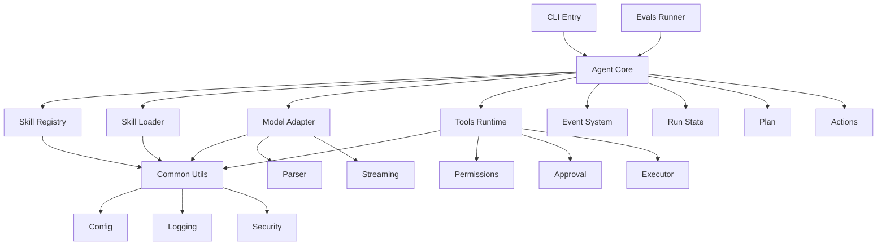

# 系统框架设计文档

本文档定义整个 Agent Skills 系统的框架结构、核心数据结构、模块组织、依赖关系与开发规范，为后续实现提供统一的技术基础。

总览参见：[agent-skills-tech-design.md](file:///Users/peng/Me/Ai/skills-agent/docs/agent-skills-tech-design.md)。

---

## 1. 项目目录结构

```
skills-agent/
├── src/
│   ├── agent/                    # Agent Core 模块
│   │   ├── __init__.py
│   │   ├── core.py              # AgentCore 主类
│   │   ├── state.py             # Run State 数据结构
│   │   ├── plan.py              # Plan 相关数据结构
│   │   ├── actions.py           # 结构化动作定义
│   │   ├── context_manager.py   # 上下文窗口管理
│   │   ├── events.py            # 事件流定义
│   │   └── recovery.py          # 持久化与恢复
│   │
│   ├── skills/                   # Skills 子系统
│   │   ├── __init__.py
│   │   ├── registry.py          # Skill Registry
│   │   ├── loader.py            # Skill Loader
│   │   ├── metadata.py          # 技能元数据结构
│   │   └── frontmatter.py       # YAML 前言解析
│   │
│   ├── model/                    # Model Adapter 模块
│   │   ├── __init__.py
│   │   ├── adapter.py           # ModelAdapter 抽象基类
│   │   ├── mock.py              # MockModel 实现
│   │   ├── openai_compat.py     # OpenAI-compatible 适配
│   │   ├── anthropic.py         # Anthropic 适配 (可选)
│   │   ├── parser.py            # 结构化输出解析
│   │   └── streaming.py         # 流式 JSON 解析器
│   │
│   ├── tools/                    # Tools Runtime 模块
│   │   ├── __init__.py
│   │   ├── runtime.py           # ToolsRuntime 主类
│   │   ├── permissions.py       # 权限模型
│   │   ├── approval.py          # 审批机制
│   │   ├── executor.py          # 工具执行器
│   │   └── tools/               # 具体工具实现
│   │       ├── read_file.py
│   │       ├── list_dir.py
│   │       ├── grep.py
│   │       └── run_script.py
│   │
│   ├── distribution/             # 分发与 CLI 模块
│   │   ├── __init__.py
│   │   ├── cli.py               # CLI 入口
│   │   ├── installer.py         # 技能包安装器
│   │   ├── verifier.py          # 完整性校验
│   │   └── commands/            # CLI 子命令
│   │       ├── run.py
│   │       ├── skills.py
│   │       ├── config.py
│   │       └── evals.py
│   │
│   ├── evals/                    # 评估与回归模块
│   │   ├── __init__.py
│   │   ├── runner.py            # Evals Runner
│   │   ├── metrics.py           # 指标计算
│   │   └── cases.py             # 用例加载与定义
│   │
│   ├── common/                   # 公共基础设施
│   │   ├── __init__.py
│   │   ├── config.py            # 配置加载
│   │   ├── logging.py           # 日志配置
│   │   ├── security.py          # 安全工具（路径校验等）
│   │   ├── io.py                # 文件 I/O 工具
│   │   └── hash.py              # 哈希与校验
│   │
│   └── __init__.py
│
├── skills_builtin/               # 内置技能目录
│   ├── example-skill/
│   │   ├── SKILL.md
│   │   └── scripts/
│   └── base-utils/
│       └── SKILL.md
│
├── tests/                        # 测试目录
│   ├── unit/                    # 单元测试
│   │   ├── test_agent_core.py
│   │   ├── test_skill_registry.py
│   │   ├── test_skill_loader.py
│   │   ├── test_model_adapter.py
│   │   └── test_tools_runtime.py
│   ├── integration/             # 集成测试
│   │   ├── test_full_run.py
│   │   └── test_skill_loading.py
│   ├── fixtures/                # 测试数据
│   │   ├── skills/
│   │   └── configs/
│   └── conftest.py              # pytest 配置
│
├── docs/                         # 文档目录
│   ├── agent-skills.md
│   ├── agent-skills-tech-design.md
│   └── design/
│       ├── framework-architecture.md
│       ├── agent-core.md
│       ├── model-adapter.md
│       ├── skill-loader.md
│       ├── skill-registry.md
│       ├── tools-runtime.md
│       ├── distribution-cli.md
│       └── evals.md
│
├── .agent/                       # 本地 Agent 数据目录 (不提交)
│   ├── skills/                  # 项目级技能
│   ├── runs/                    # 运行记录
│   ├── cache/                   # 缓存
│   └── config.json              # 本地配置
│
├── pyproject.toml               # 项目配置
├── README.md
└── LICENSE
```

---

## 2. 核心数据结构定义

### 2.1 运行态状态（Run State）

**文件**: `src/agent/state.py`

```python
from dataclasses import dataclass, field
from typing import List, Dict, Optional, Any
from enum import Enum
from datetime import datetime

@dataclass
class ToolBudget:
    """资源预算"""
    # 上限配置
    max_turns: int = 12
    max_tool_calls: int = 30
    max_script_executions: int = 10
    max_context_tokens: int = 100000

    # 运行时追踪
    turns_used: int = 0
    tool_calls_used: int = 0
    script_executions_used: int = 0
    context_tokens_used: int = 0

    def can_continue(self) -> bool:
        """检查是否还有预算"""
        return (
            self.turns_used < self.max_turns and
            self.tool_calls_used < self.max_tool_calls and
            self.script_executions_used < self.max_script_executions
        )

    def is_near_limit(self, threshold: float = 0.8) -> bool:
        """检查是否接近预算上限"""
        ratios = [
            self.turns_used / self.max_turns if self.max_turns > 0 else 0,
            self.tool_calls_used / self.max_tool_calls if self.max_tool_calls > 0 else 0,
            self.script_executions_used / self.max_script_executions if self.max_script_executions > 0 else 0,
        ]
        return any(r >= threshold for r in ratios)

    def to_dict(self) -> Dict[str, Any]:
        """序列化为字典"""
        return {
            "max_turns": self.max_turns,
            "max_tool_calls": self.max_tool_calls,
            "max_script_executions": self.max_script_executions,
            "max_context_tokens": self.max_context_tokens,
            "turns_used": self.turns_used,
            "tool_calls_used": self.tool_calls_used,
            "script_executions_used": self.script_executions_used,
            "context_tokens_used": self.context_tokens_used,
        }

@dataclass
class Observation:
    """观察结果"""
    action_type: str
    success: bool
    output: str
    error: Optional[str] = None
    metadata: Dict[str, Any] = field(default_factory=dict)
    turn: int = 0
    timestamp: datetime = field(default_factory=datetime.now)

    def to_dict(self) -> Dict[str, Any]:
        """序列化为字典"""
        return {
            "action_type": self.action_type,
            "success": self.success,
            "output": self.output,
            "error": self.error,
            "metadata": self.metadata,
            "turn": self.turn,
            "timestamp": self.timestamp.isoformat(),
        }

class RunStatus(Enum):
    """运行状态枚举"""
    INITIALIZING = "initializing"
    RUNNING = "running"
    COMPLETED = "completed"
    FAILED = "failed"
    PAUSED = "paused"

@dataclass
class RunState:
    """Agent 运行状态"""
    run_id: str
    request: str
    status: RunStatus = RunStatus.INITIALIZING

    # 技能相关
    skill_index: List[Any] = field(default_factory=list)  # List[SkillMetadata]
    loaded_skills: Dict[str, Any] = field(default_factory=dict)  # Dict[str, LoadedSkill]

    # 规划与执行
    plan: Optional[Any] = None  # Optional[Plan]
    budget: ToolBudget = field(default_factory=ToolBudget)
    observations: List[Observation] = field(default_factory=list)

    # 轮次追踪
    current_turn: int = 0

    # 上下文管理
    context_tokens_estimate: int = 0

    # 错误信息
    error: Optional[str] = None
    error_trace: Optional[str] = None

    # 元数据
    created_at: datetime = field(default_factory=datetime.now)
    updated_at: datetime = field(default_factory=datetime.now)

    def to_dict(self) -> Dict[str, Any]:
        """序列化为字典（用于持久化）"""
        return {
            "run_id": self.run_id,
            "request": self.request,
            "status": self.status.value,
            "current_turn": self.current_turn,
            "budget": self.budget.to_dict(),
            "error": self.error,
            "created_at": self.created_at.isoformat(),
            "updated_at": self.updated_at.isoformat(),
            "loaded_skills": list(self.loaded_skills.keys()),
            "observations_count": len(self.observations),
        }
```

### 2.2 计划（Plan）

**文件**: `src/agent/plan.py`

```python
from dataclasses import dataclass, field
from typing import List, Dict, Any, Optional
from enum import Enum

class StepStatus(Enum):
    """步骤状态"""
    PENDING = "pending"
    IN_PROGRESS = "in_progress"
    COMPLETED = "completed"
    FAILED = "failed"
    SKIPPED = "skipped"

@dataclass
class PlanStep:
    """规划步骤"""
    id: str
    title: str
    status: StepStatus = StepStatus.PENDING
    reason: Optional[str] = None
    dependencies: List[str] = field(default_factory=list)
    started_at: Optional[str] = None
    completed_at: Optional[str] = None

    def to_dict(self) -> Dict[str, Any]:
        return {
            "id": self.id,
            "title": self.title,
            "status": self.status.value,
            "reason": self.reason,
            "dependencies": self.dependencies,
            "started_at": self.started_at,
            "completed_at": self.completed_at,
        }

    @classmethod
    def from_dict(cls, data: Dict[str, Any]) -> "PlanStep":
        return cls(
            id=data["id"],
            title=data["title"],
            status=StepStatus(data.get("status", "pending")),
            reason=data.get("reason"),
            dependencies=data.get("dependencies", []),
            started_at=data.get("started_at"),
            completed_at=data.get("completed_at"),
        )

@dataclass
class Plan:
    """Agent 规划"""
    goal: str
    steps: List[PlanStep]
    assumptions: List[str] = field(default_factory=list)
    constraints: Dict[str, Any] = field(default_factory=dict)
    version: int = 1

    def to_dict(self) -> Dict[str, Any]:
        return {
            "goal": self.goal,
            "steps": [step.to_dict() for step in self.steps],
            "assumptions": self.assumptions,
            "constraints": self.constraints,
            "version": self.version,
        }

    @classmethod
    def from_dict(cls, data: Dict[str, Any]) -> "Plan":
        return cls(
            goal=data["goal"],
            steps=[PlanStep.from_dict(s) for s in data["steps"]],
            assumptions=data.get("assumptions", []),
            constraints=data.get("constraints", {}),
            version=data.get("version", 1),
        )

    def update_step_status(self, step_id: str, status: StepStatus) -> bool:
        """更新步骤状态"""
        for step in self.steps:
            if step.id == step_id:
                step.status = status
                return True
        return False

    def get_next_pending_step(self) -> Optional[PlanStep]:
        """获取下一个待执行步骤（考虑依赖）"""
        for step in self.steps:
            if step.status != StepStatus.PENDING:
                continue

            # 检查依赖是否都已完成
            dependencies_met = all(
                self.is_step_completed(dep_id)
                for dep_id in step.dependencies
            )

            if dependencies_met:
                return step

        return None

    def is_step_completed(self, step_id: str) -> bool:
        """检查步骤是否已完成"""
        for step in self.steps:
            if step.id == step_id:
                return step.status == StepStatus.COMPLETED
        return False
```

### 2.3 结构化动作

**文件**: `src/agent/actions.py`

```python
from dataclasses import dataclass, field
from typing import List, Dict, Any, Optional, Literal, Union
from abc import ABC, abstractmethod

class Action(ABC):
    """动作基类"""

    @abstractmethod
    def action_type(self) -> str:
        """返回动作类型"""
        pass

    @abstractmethod
    def to_dict(self) -> Dict[str, Any]:
        """序列化为字典"""
        pass

    @abstractmethod
    def validate(self) -> bool:
        """验证动作参数"""
        pass

@dataclass
class SkillReference:
    """技能引用"""
    name: str
    source: Optional[str] = None  # project/user/builtin

    def to_dict(self) -> Dict[str, Any]:
        return {"name": self.name, "source": self.source}

    @classmethod
    def from_dict(cls, data: Dict[str, Any]) -> "SkillReference":
        return cls(name=data["name"], source=data.get("source"))

@dataclass
class SelectSkillsAction(Action):
    """选择技能动作"""
    skills: List[SkillReference]
    reason: str

    def action_type(self) -> str:
        return "select_skills"

    def to_dict(self) -> Dict[str, Any]:
        return {
            "action": "select_skills",
            "skills": [s.to_dict() for s in self.skills],
            "reason": self.reason,
        }

    def validate(self) -> bool:
        return len(self.skills) > 0 and bool(self.reason)

    @classmethod
    def from_dict(cls, data: Dict[str, Any]) -> "SelectSkillsAction":
        return cls(
            skills=[SkillReference.from_dict(s) for s in data["skills"]],
            reason=data["reason"],
        )

@dataclass
class LoadResourceAction(Action):
    """加载资源动作"""
    skill: SkillReference
    relative_path: str
    section_hint: Optional[str] = None

    def action_type(self) -> str:
        return "load_resource"

    def to_dict(self) -> Dict[str, Any]:
        return {
            "action": "load_resource",
            "skill": self.skill.to_dict(),
            "relative_path": self.relative_path,
            "section_hint": self.section_hint,
        }

    def validate(self) -> bool:
        return bool(self.relative_path) and ".." not in self.relative_path

    @classmethod
    def from_dict(cls, data: Dict[str, Any]) -> "LoadResourceAction":
        return cls(
            skill=SkillReference.from_dict(data["skill"]),
            relative_path=data["relative_path"],
            section_hint=data.get("section_hint"),
        )

@dataclass
class RunScriptAction(Action):
    """执行脚本动作"""
    skill: SkillReference
    relative_path: str
    args: List[str] = field(default_factory=list)
    env: Dict[str, str] = field(default_factory=dict)

    def action_type(self) -> str:
        return "run_script"

    def to_dict(self) -> Dict[str, Any]:
        return {
            "action": "run_script",
            "skill": self.skill.to_dict(),
            "relative_path": self.relative_path,
            "args": self.args,
            "env": self.env,
        }

    def validate(self) -> bool:
        return bool(self.relative_path) and ".." not in self.relative_path

    @classmethod
    def from_dict(cls, data: Dict[str, Any]) -> "RunScriptAction":
        return cls(
            skill=SkillReference.from_dict(data["skill"]),
            relative_path=data["relative_path"],
            args=data.get("args", []),
            env=data.get("env", {}),
        )

@dataclass
class FinalAnswerAction(Action):
    """最终答复动作"""
    answer: str
    completed: bool = True

    def action_type(self) -> str:
        return "final_answer"

    def to_dict(self) -> Dict[str, Any]:
        return {
            "action": "final_answer",
            "answer": self.answer,
            "completed": self.completed,
        }

    def validate(self) -> bool:
        return bool(self.answer)

    @classmethod
    def from_dict(cls, data: Dict[str, Any]) -> "FinalAnswerAction":
        return cls(
            answer=data["answer"],
            completed=data.get("completed", True),
        )

@dataclass
class PlanUpdateAction(Action):
    """规划更新动作"""
    updates: Dict[str, Any]

    def action_type(self) -> str:
        return "plan_update"

    def to_dict(self) -> Dict[str, Any]:
        return {
            "action": "plan_update",
            "updates": self.updates,
        }

    def validate(self) -> bool:
        return bool(self.updates)

    @classmethod
    def from_dict(cls, data: Dict[str, Any]) -> "PlanUpdateAction":
        return cls(updates=data["updates"])

# 联合类型
AgentAction = Union[
    SelectSkillsAction,
    LoadResourceAction,
    RunScriptAction,
    FinalAnswerAction,
    PlanUpdateAction,
]

def parse_action(data: Dict[str, Any]) -> AgentAction:
    """从字典解析动作"""
    action_type = data.get("action")

    if action_type == "select_skills":
        return SelectSkillsAction.from_dict(data)
    elif action_type == "load_resource":
        return LoadResourceAction.from_dict(data)
    elif action_type == "run_script":
        return RunScriptAction.from_dict(data)
    elif action_type == "final_answer":
        return FinalAnswerAction.from_dict(data)
    elif action_type == "plan_update":
        return PlanUpdateAction.from_dict(data)
    else:
        raise ValueError(f"Unknown action type: {action_type}")
```

### 2.4 技能元数据

**文件**: `src/skills/metadata.py`

```python
from dataclasses import dataclass, field
from typing import List, Dict, Any, Optional
from pathlib import Path

@dataclass
class ResourceLimits:
    """资源配额限制"""
    max_script_time_sec: int = 30
    max_memory_mb: int = 512
    max_concurrent_scripts: int = 2
    allow_network: bool = False

    def to_dict(self) -> Dict[str, Any]:
        return {
            "max_script_time_sec": self.max_script_time_sec,
            "max_memory_mb": self.max_memory_mb,
            "max_concurrent_scripts": self.max_concurrent_scripts,
            "allow_network": self.allow_network,
        }

    @classmethod
    def from_dict(cls, data: Dict[str, Any]) -> "ResourceLimits":
        return cls(
            max_script_time_sec=data.get("max_script_time_sec", 30),
            max_memory_mb=data.get("max_memory_mb", 512),
            max_concurrent_scripts=data.get("max_concurrent_scripts", 2),
            allow_network=data.get("allow_network", False),
        )

@dataclass
class SkillMetadata:
    """技能元数据（Level 1）"""
    skill_id: str
    name: str
    description: str
    source: str  # project/user/builtin
    path: Path

    # 可选字段
    version: Optional[str] = None
    author: Optional[str] = None
    allowed_tools: Optional[List[str]] = None
    disable_model_invocation: bool = False
    user_invocable: bool = True
    requires: List[str] = field(default_factory=list)
    load_priority: str = "normal"  # high/normal/low
    resource_limits: ResourceLimits = field(default_factory=ResourceLimits)

    # 元信息
    frontmatter_hash: Optional[str] = None
    scanned_at: Optional[str] = None

    def to_dict(self) -> Dict[str, Any]:
        return {
            "skill_id": self.skill_id,
            "name": self.name,
            "description": self.description,
            "source": self.source,
            "path": str(self.path),
            "version": self.version,
            "author": self.author,
            "allowed_tools": self.allowed_tools,
            "disable_model_invocation": self.disable_model_invocation,
            "user_invocable": self.user_invocable,
            "requires": self.requires,
            "load_priority": self.load_priority,
            "resource_limits": self.resource_limits.to_dict(),
            "frontmatter_hash": self.frontmatter_hash,
            "scanned_at": self.scanned_at,
        }

    @classmethod
    def from_dict(cls, data: Dict[str, Any]) -> "SkillMetadata":
        return cls(
            skill_id=data["skill_id"],
            name=data["name"],
            description=data["description"],
            source=data["source"],
            path=Path(data["path"]),
            version=data.get("version"),
            author=data.get("author"),
            allowed_tools=data.get("allowed_tools"),
            disable_model_invocation=data.get("disable_model_invocation", False),
            user_invocable=data.get("user_invocable", True),
            requires=data.get("requires", []),
            load_priority=data.get("load_priority", "normal"),
            resource_limits=ResourceLimits.from_dict(data.get("resource_limits", {})),
            frontmatter_hash=data.get("frontmatter_hash"),
            scanned_at=data.get("scanned_at"),
        )

    def get_priority_score(self) -> int:
        """获取优先级分数（用于排序）"""
        priority_map = {"high": 0, "normal": 1, "low": 2}
        return priority_map.get(self.load_priority, 1)

@dataclass
class LoadedSkill:
    """已加载技能（Level 2）"""
    metadata: SkillMetadata
    body: str
    loaded_at_turn: int
    token_estimate: int
    body_hash: Optional[str] = None

    def to_dict(self) -> Dict[str, Any]:
        return {
            "metadata": self.metadata.to_dict(),
            "body_preview": self.body[:200] + "..." if len(self.body) > 200 else self.body,
            "loaded_at_turn": self.loaded_at_turn,
            "token_estimate": self.token_estimate,
            "body_hash": self.body_hash,
        }
```

### 2.5 事件流

**文件**: `src/agent/events.py`

```python
from dataclasses import dataclass, field
from typing import Dict, Any, Optional
from datetime import datetime
from enum import Enum

class EventType(Enum):
    """事件类型"""
    # Run 级
    RUN_STARTED = "run_started"
    RUN_FINISHED = "run_finished"

    # Turn 级
    TURN_STARTED = "turn_started"
    TURN_FINISHED = "turn_finished"

    # 模型级
    MODEL_REQUEST = "model_request"
    MODEL_RESPONSE = "model_response"
    MODEL_DELTA = "model_delta"

    # 动作级
    ACTION_PLANNED = "action_planned"
    ACTION_VALIDATED = "action_validated"
    ACTION_EXECUTED = "action_executed"

    # 观察级
    OBSERVATION_RECORDED = "observation_recorded"

    # 计划级
    PLAN_CREATED = "plan_created"
    PLAN_UPDATED = "plan_updated"

    # 审批级
    APPROVAL_REQUIRED = "approval_required"
    APPROVAL_GRANTED = "approval_granted"
    APPROVAL_DENIED = "approval_denied"

    # 错误级
    ERROR_OCCURRED = "error_occurred"

    # 技能级
    SKILL_LOADED = "skill_loaded"
    RESOURCE_LOADED = "resource_loaded"

@dataclass
class Event:
    """事件基类"""
    type: EventType
    run_id: str
    turn: int
    data: Dict[str, Any] = field(default_factory=dict)
    timestamp: datetime = field(default_factory=datetime.now)

    def to_dict(self) -> Dict[str, Any]:
        return {
            "type": self.type.value,
            "run_id": self.run_id,
            "turn": self.turn,
            "data": self.data,
            "timestamp": self.timestamp.isoformat(),
        }

    def to_json_line(self) -> str:
        """序列化为 JSONL 格式"""
        import json
        return json.dumps(self.to_dict(), ensure_ascii=False)
```

---

## 3. 模块依赖关系图



---

## 4. 核心接口定义

### 4.1 Agent Core 接口

```python
class AgentCore:
    """Agent 核心执行引擎"""

    def __init__(
        self,
        skill_registry: SkillRegistry,
        skill_loader: SkillLoader,
        model_adapter: ModelAdapter,
        tools_runtime: ToolsRuntime,
        config: Dict[str, Any],
    ):
        ...

    def run(self, request: str, resume_run_id: Optional[str] = None) -> RunState:
        """执行用户请求"""
        ...

    def _initialize_run_state(self, request: str) -> RunState:
        """初始化运行状态"""
        ...

    def _decide(self, state: RunState) -> List[AgentAction]:
        """Reason 阶段：请求模型决策"""
        ...

    def _act(self, state: RunState, action: AgentAction) -> Observation:
        """Act 阶段：执行动作"""
        ...

    def _save_run_state(self, state: RunState):
        """持久化运行状态"""
        ...

    def _load_run_state(self, run_id: str) -> RunState:
        """加载运行状态（用于恢复）"""
        ...
```

### 4.2 Skill Registry 接口

```python
class SkillRegistry:
    """技能注册表"""

    def __init__(self, skill_roots: List[Dict[str, Any]]):
        ...

    def scan_all(self) -> List[SkillMetadata]:
        """扫描所有技能根目录，返回元数据列表"""
        ...

    def find_skill(
        self,
        name: str,
        source: Optional[str] = None
    ) -> Optional[SkillMetadata]:
        """查找技能"""
        ...

    def refresh(self):
        """刷新技能索引"""
        ...
```

### 4.3 Skill Loader 接口

```python
class SkillLoader:
    """技能加载器"""

    def load_body(
        self,
        skill_path: Path,
        limits: Optional[Dict[str, Any]] = None
    ) -> Tuple[str, int]:
        """加载技能正文，返回 (正文, token估算)"""
        ...

    def load_resource(
        self,
        skill_path: Path,
        relative_path: str,
        section_hint: Optional[str] = None,
        max_tokens: int = 2000
    ) -> str:
        """加载资源文件（片段或摘要）"""
        ...
```

### 4.4 Model Adapter 接口

```python
class ModelAdapter(ABC):
    """模型适配器抽象基类"""

    @abstractmethod
    def generate(self, context: Dict[str, Any]) -> Dict[str, Any]:
        """生成模型响应"""
        ...

    @abstractmethod
    def generate_streaming(
        self,
        context: Dict[str, Any],
        callback: Optional[Callable] = None
    ) -> Dict[str, Any]:
        """流式生成"""
        ...
```

### 4.5 Tools Runtime 接口

```python
class ToolsRuntime:
    """工具运行时"""

    def __init__(self, config: Dict[str, Any]):
        ...

    def run_script(
        self,
        script_path: Path,
        args: List[str],
        env: Dict[str, str],
        resource_limits: ResourceLimits,
        approval_required: bool = True
    ) -> Dict[str, Any]:
        """执行脚本"""
        ...

    def read_file(
        self,
        file_path: Path,
        max_bytes: int = 1000000
    ) -> Dict[str, Any]:
        """读取文件"""
        ...

    def check_permission(
        self,
        tool_name: str,
        skill_metadata: SkillMetadata,
        global_config: Dict[str, Any]
    ) -> bool:
        """检查工具权限"""
        ...
```

---

## 5. 配置文件格式

### 5.1 全局配置 `.agent/config.json`

```json
{
  "skill_roots": [
    {
      "source": "project",
      "path": ".agent/skills",
      "priority": 0
    },
    {
      "source": "user",
      "path": "~/.agent/skills",
      "priority": 1
    },
    {
      "source": "builtin",
      "path": "/path/to/skills_builtin",
      "priority": 2
    }
  ],
  "model": {
    "provider": "mock",
    "params": {
      "model_name": "mock-v1"
    }
  },
  "budget": {
    "max_turns": 12,
    "max_tool_calls": 30,
    "max_script_executions": 10,
    "max_context_tokens": 100000
  },
  "execution": {
    "require_approval_for": ["run_script", "write_file", "network_request"],
    "allowed_tools": ["read_file", "list_dir", "grep", "run_script"]
  },
  "security": {
    "max_skill_body_lines": 500,
    "max_resource_file_bytes": 2000000,
    "block_angle_brackets_in_frontmatter": true
  },
  "logging": {
    "level": "INFO",
    "format": "json",
    "output": "console"
  }
}
```

---

## 6. 开发规范

### 6.1 代码风格

- 遵循 PEP 8
- 使用 type hints
- 所有公共方法必须有 docstring
- 优先使用 `dataclass` 定义数据结构

### 6.2 错误处理

```python
# 定义自定义异常
class SkillsAgentError(Exception):
    """基础异常类"""
    pass

class SkillNotFoundError(SkillsAgentError):
    """技能未找到"""
    pass

class PathTraversalError(SkillsAgentError):
    """路径越界"""
    pass

class BudgetExceededError(SkillsAgentError):
    """预算耗尽"""
    pass
```

### 6.3 日志规范

```python
import logging

logger = logging.getLogger(__name__)

# 分级使用
logger.debug("详细调试信息")
logger.info("关键流程节点")
logger.warning("潜在问题")
logger.error("执行错误", exc_info=True)
```

### 6.4 测试规范

- 单元测试覆盖率 > 80%
- 所有公共接口必须有测试
- 使用 pytest fixtures
- Mock 外部依赖（模型调用、文件 I/O）

---

## 7. 数据流示例

### 7.1 完整执行流程

```
User Request
    ↓
[CLI] 解析参数
    ↓
[AgentCore] 初始化 RunState
    ↓
[SkillRegistry] 扫描技能 → SkillIndex
    ↓
[AgentCore] 第一次 Decide
    ↓
[ModelAdapter] 生成动作 → SelectSkillsAction
    ↓
[SkillLoader] 加载技能正文 → LoadedSkill
    ↓
[AgentCore] 注入上下文，第二次 Decide
    ↓
[ModelAdapter] 生成动作 → RunScriptAction
    ↓
[ToolsRuntime] 权限检查 → 审批 → 执行
    ↓
[AgentCore] 收集 Observation
    ↓
[AgentCore] 第三次 Decide
    ↓
[ModelAdapter] 生成动作 → FinalAnswerAction
    ↓
[AgentCore] 持久化 RunState
    ↓
返回结果给用户
```

---

## 8. 性能与优化考虑

### 8.1 缓存策略

- **技能索引缓存**：首次扫描后缓存到内存，仅在显式刷新时重新扫描
- **YAML 解析缓存**：对已解析的前言缓存结果（基于文件 mtime）
- **模型响应缓存**：MockModel 可缓存固定响应

### 8.2 并发优化

- 技能正文加载可并发（使用 `concurrent.futures.ThreadPoolExecutor`）
- 多个只读工具调用可并发
- 脚本执行保持串行（避免资源竞争）

### 8.3 内存优化

- 大文本资源不全量加载到内存
- 观察结果超过阈值落盘，只保留引用
- 历史对话压缩存储

---

## 9. 下一步开发建议

### 9.1 MVP 实现顺序

1. **公共基础设施** (`src/common/`)
   - 配置加载
   - 日志系统
   - 安全工具（路径校验）

2. **数据结构定义** (`src/agent/state.py`, `src/agent/plan.py`, `src/agent/actions.py`)
   - RunState
   - Plan
   - Actions

3. **技能子系统** (`src/skills/`)
   - YAML 前言解析
   - Skill Registry
   - Skill Loader

4. **MockModel** (`src/model/mock.py`)
   - 固定输出测试

5. **Agent Core 骨架** (`src/agent/core.py`)
   - 主循环
   - 状态持久化

6. **Tools Runtime** (`src/tools/`)
   - 只读工具
   - run_script

7. **CLI** (`src/distribution/cli.py`)
   - 基本命令

### 9.2 测试驱动开发

每个模块开发前先写测试用例：

```python
# tests/unit/test_skill_registry.py
def test_scan_skills_from_directory():
    """测试技能扫描"""
    registry = SkillRegistry([{"source": "test", "path": "tests/fixtures/skills"}])
    skills = registry.scan_all()
    assert len(skills) > 0
    assert all(s.name for s in skills)
```

---

## 10. 总结

本框架设计文档定义了：

✅ **清晰的目录结构**：模块化组织，职责明确
✅ **完整的数据结构**：RunState、Plan、Actions、SkillMetadata、Events
✅ **统一的接口规范**：各子系统接口契约
✅ **标准化配置格式**：JSON 配置文件
✅ **开发规范**：代码风格、错误处理、日志、测试
✅ **性能优化方向**：缓存、并发、内存管理

所有设计都与总体技术设计文档保持一致，为后续开发提供了坚实的技术基础。
