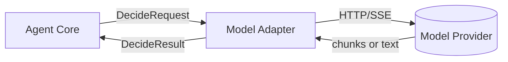

# Model Adapter 设计

本文档细化模型适配层：统一接口、结构化动作输出协议、解析与重试策略、流式（token 级）结构化输出、以及 MockModel 的实现要求。整体协作见：[agent-core.md](file:///Users/peng/Me/Ai/skills-agent/docs/design/agent-core.md)。

## 1. 目标与边界

### 1.1 目标

- 不绑定供应商：可适配 OpenAI-compatible/Anthropic/本地模型
- 强制结构化动作输出：每轮 `Decide` 产出可校验 JSON（动作 + 可选 plan_update）
- 支持鲁棒解析：容忍噪声、提供纠错与重试、可降级
- 支持 token 级流式体验：在保持结构化 JSON 的前提下增量解析并触发回调
- 支持审计与评估：输出可被 Agent Core 落盘回放的关键摘要/哈希

### 1.2 边界（不做什么）

- 不做技能扫描/加载：由 Skill Registry / Skill Loader 负责
- 不做工具执行/权限：由 Tools Runtime 负责
- 不做业务规划策略：Plan 的更新语义由 Agent Core 决定

## 2. 系统定位（中枢协作）

Model Adapter 是“模型 I/O 可靠性层”，把上层固定格式的上下文输入（messages + 预算 + schema 契约）转换为“本轮唯一动作”的结构化 JSON 输出。



## 3. 统一接口（非代码约定）

### 3.1 非流式接口

- 输入：`DecideRequest`
- 输出：`DecideResult`（包含 `action`、可选 `plan_update`、可选 `diagnostics`）

### 3.2 流式接口

- 输入：`DecideRequest` + 回调注册（可选）
- 输出：同样必须在流结束时产出 `DecideResult`
- 过程：边接收 chunk 边解析，并在命中关键路径时触发回调（用于 token 级回显）

语义约束：

- 每轮 `Decide` 最终必须完成一次“完整 JSON 校验”；流式回调只用于体验，不可绕过校验
- 每轮必须输出一个动作（one action per turn）

### 3.3 DecideRequest（建议字段）

- `messages`：OpenAI 风格 messages（system/developer/user/assistant）
- `schema_hint`：输出 JSON schema 的文本化契约（固定模板）
- `budget`：如 `max_output_chars`、`max_retries`、`allow_streaming`
- `telemetry`：如 `run_id`、`turn`（用于审计关联）

### 3.4 DecideResult（建议字段）

```json
{
  "action": {"type": "select_skills", "payload": {}},
  "plan_update": null,
  "diagnostics": null,
  "raw": {"hash": "...", "size": 1234}
}
```

## 4. 结构化动作协议（与整体设计对齐）

### 4.1 顶层结构（统一 schema）

每次 `Decide` 的模型输出必须是单个 JSON 对象，不得包含 code fence 或解释性文本：

```json
{
  "action": {"type": "select_skills", "payload": {}},
  "plan_update": null,
  "diagnostics": null
}
```

### 4.2 action.type 枚举

- `select_skills`
- `load_resource`
- `run_script`
- `final_answer`

### 4.3 action.payload（概要）

`select_skills`：

```json
{
  "skills": [{"name": "pdf-form-filler", "source": "project"}],
  "reason": "..."
}
```

`load_resource`：

```json
{
  "skill": {"name": "pdf-form-filler", "source": "project"},
  "relative_path": "reference/kpi.md",
  "section_hint": "## 指标定义"
}
```

`run_script`：

```json
{
  "skill": {"name": "pdf-form-filler", "source": "project"},
  "relative_path": "scripts/fill.py",
  "args": ["--input", "data.json"]
}
```

`final_answer`：

```json
{
  "content": "..."
}
```

Model Adapter 的最小校验只保证“能被 Agent Core 接收并进入 Guardrails”；路径越界、技能是否存在、工具权限等由 Agent Core / Tools Runtime 负责。

### 4.4 plan_update（结构保证，不解释语义）

plan_update 允许两种形式：

- replace：输出完整 plan
- patch：输出 ops 列表

```json
{
  "mode": "patch",
  "ops": [{"op": "set", "path": "/steps/s2/status", "value": "in_progress"}]
}
```

## 5. 提示词契约（Decide Prompt Contract）

### 5.1 强约束模板（要点）

每次 Decide 的提示词必须包含：

- 只能输出一个 JSON 对象
- 不允许输出 Markdown、解释、前后缀文本
- 必须包含 `action.type` 与 `action.payload`
- 本轮只能输出一个动作（后续动作通过下一轮 Decide 实现）

### 5.2 与 Skills 渐进披露对齐

提示词需要与 Agent Core 的上下文分区对齐：

- 当仅提供 skills index（Level 1）时：模型应先选择技能而不是假设技能正文内容
- 当已加载技能正文（Level 2）时：模型可按技能流程请求资源或执行脚本
- 当 observation 进入上下文（Level 3）时：模型应基于 observation 更新计划并决定下一动作

## 6. 解析、校验与重试

### 6.1 解析策略（优先级）

1. 直接解析整体输出为 JSON
2. 若包含噪声文本：提取最外层 JSON 对象再解析
3. 仍失败：触发纠错重试（要求“仅输出修正后的 JSON”）

### 6.2 最小 schema 校验

- `action` 必须是 object
- `action.type` 必须是枚举之一
- `action.payload` 必须是 object

### 6.3 纠错与重试策略

- 第一次失败：返回明确错误原因 + 期望 schema，要求模型仅输出修正 JSON
- 第二次失败：允许降级为 `final_answer`（结构化输出“无法继续”的原因与建议）

所有重试必须计入预算，并把错误原因、重试次数、输出哈希落盘（由 Agent Core 记录）。

## 7. Token 级流式：结构化 JSON 的流式解析

### 7.1 为什么可行

整体设计要求“每轮交互 JSON schema 固定”，因此可以在模型输出过程中就解析出关键路径并实时回显，同时保证最终仍能得到一个可校验的完整 JSON 对象。

### 7.2 解析器能力要求

- 输入：chunk 字符流（SSE data 或 HTTP chunked body）
- 解析：逐字符有限状态机，维护 stack（对象/数组/根值）与 path（属性名/数组索引）
- 匹配：路径匹配支持精确/通配符 `*`
- 回调模式：
  - realtime：解析过程中立即回调
  - incremental：对字符串字段只回调新增部分（delta），避免重复回传完整值

### 7.3 路径回调建议（用于事件流）

- `$.action.type`
- `$.action.payload.skills[*].name`、`$.action.payload.skills[*].source`
- `$.action.payload.content`（当 `action.type == final_answer`，作为 token/delta 输出）
- `$.plan_update`（可选）

### 7.4 失败回退

- JSON 不闭合或最终校验失败：本轮 Decide 失败，交给 Agent Core 走“重试/降级”策略
- 流式回调与最终对象不一致：以最终校验通过的对象为准，回调仅用于体验

## 8. 供应商适配（纯原生实现约束）

在 Python 纯原生约束下，建议使用标准库 HTTP 客户端实现：

- OpenAI-compatible：按配置对接 chat completions / responses
- Anthropic：按 messages 接口对接（如启用）
- Local：对接自建 HTTP endpoint

适配层需要把“传输层格式差异”规整为：

- 非流式：一次性完整文本
- 流式：统一的 chunk 迭代器（字符/字节）

## 9. 安全与隐私（与审计协同）

- 默认不记录完整 prompt 与完整模型输出；只记录必要字段、摘要与哈希
- 流式 delta 事件对外可见，但落盘可只存摘要/哈希并把原文交给客户端会话层保留
- 若启用开发调试落原文，必须显式配置开启

## 10. MockModel（评估与回归依赖）

### 10.1 目标

- 用例驱动输出动作序列
- 支持 evals 离线回归
- 能模拟流式输出，用于验证“流式 JSON 解析 + token 级回显”链路

### 10.2 流式模拟

- 非流式：直接返回完整 JSON
- 流式：将同一 JSON 拆分为多个 chunk（可按固定字符数、或按字段边界拆分），并确保：
  - 回调可命中关键路径（例如 `$.action.type`、`$.action.payload.content`）
  - 流结束后仍能重建出与非流式一致的完整 JSON 对象
